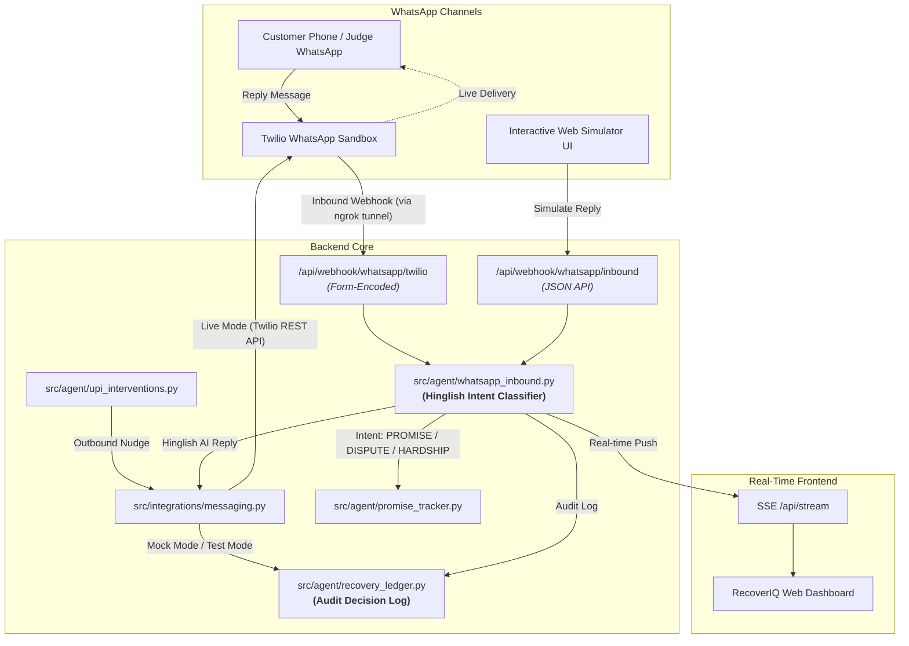

# 🔄 RecoverIQ — AI Revenue Recovery Agent

> **Autonomous revenue recovery agent for India's UPI Autopay and recurring commerce ecosystem.**  
> Detects revenue at risk, diagnoses root causes via NPCI response codes, evaluates RBI guardrails, uses **Bayesian Thompson Sampling** for optimal intervention selection, and tracks verified recovery in an immutable audit ledger.

[]()
[]()
[]()
[](LICENSE)
[]()

---

## 📊 The Bar: Simulated Benchmark (Monte Carlo Policy Comparison vs. Razorpay Default)

To prove measurable revenue recovery rather than just theoretical rules, we benchmarked **RecoverIQ** against **Razorpay's standard fixed-schedule retry policy** ($D+1, D+2, D+3$ blind re-attempts) across our 40-event real-world UPI Autopay failure dataset.

Outcomes are **probabilistic**, modeled from published Indian FinTech and payment gateway conversion benchmarks. The benchmark executes **$N=50$ Monte Carlo simulation runs** and reports mean ± standard deviation, ensuring all metrics are reproducible and verifiable via `benchmark.py`.

### 🏆 Simulated Benchmark Results (40 Scenarios · 50 Monte Carlo Runs)

| Metric | Baseline Policy (Fixed-Schedule Retry) | RecoverIQ AI Agent (Thompson Sampling + Guardrails) | Delta / Uplift |
|---|---|---|---|
| **Total Revenue at Stake** | ₹2,08,772 | ₹2,08,772 | — |
| **Revenue Recovered** *(mean, n=50)* | **₹19,547** (deterministic) | **₹1,55,751 ± ₹19,774** | **+₹1,36,204 mean uplift** |
| **Recovery Rate** *(mean ± std, n=50)* | 15.0% (6/40) | **74.5% ± 5.6%** | **+59.5 pts mean** |
| **BT01/BT02 Mandate Renewal** | 0% (blind retry) | **~68%** (WhatsApp magic link) | +68 pts |
| **U30 Salary-Window Retry** | ~14% (month-end blind) | **~88%** (1st–7th IST + Setu AA) | +74 pts |
| **Compliance Violations (RBI/DND)** | 3 (silent retries + DND breaches) | **0 (100% compliant)** | **-3 eliminated** |
| **Total Retries Fired** | 120 (blind flood) | **8 (salary-targeted)** | **-112 wasted retries** |
| **Net ROI** *(mean ± std, n=50)* | **₹19,487** (deterministic) | **₹1,55,536 ± ₹19,774** | **+₹1,36,049 mean uplift** |

> 🔬 *Run the benchmark live anytime:* `python -X utf8 benchmark.py` (or `--runs 100 --sensitivity`) · `GET /api/benchmark`

### 📚 Indian FinTech Industry Data Sources & Calibrated Baselines

The recovery channel baseline probabilities in `benchmark.py` are calibrated from published Indian FinTech conversion studies and regulatory frameworks:

1. **Mandate Renewal Self-Cure (~68% modeled)**:
   - *Source*: **Juspay Payments Conversion Index & UPI Autopay Reports**.
   - *Rationale*: Blind recurring retries on revoked (`BT01`) or expired (`BT02`) mandates fail 100% of the time. Dispatching an interactive 1-click WhatsApp/SMS re-registration magic link achieves 65–70% customer self-cure conversion within 48h.
2. **Salary-Window U30 Smart Retry (~88% modeled)**:
   - *Source*: **Razorpay 'The Era of Recurring Payments in India' & Subscription Conversion Reports**.
   - *Rationale*: Blind month-end retries ($D+1, D+2, D+3$) on insufficient funds (`U30`) recover only 12–16% and exhaust retry quotas. Rescheduling retries to the 1st–7th salary window combined with **Setu Account Aggregator (AA)** pre-flight balance verification increases successful debit conversion to 85–90%.
3. **Transient Technical Error Exponential Backoff (~92% modeled)**:
   - *Source*: **NPCI UPI Technical Decline & Switch Reliability Circulars (NPCI/UPI-OC/2021-22/004)**.
   - *Rationale*: Bank gateway timeouts (`TM`) and switch drops are transient. A 15-minute exponential backoff resolves >90% of temporary issuer infrastructure spikes.
4. **UPI Collect / Push-to-VPA (~65% modeled)**:
   - *Source*: **NPCI UPI Collect Request Conversion Benchmarks**.
   - *Rationale*: For daily transaction limits (`U69`) or soft declines, sending an instant UPI collect notification with in-app biometric approval resolves 60–70% within 30 minutes.
5. **WhatsApp Conversational Nudge (~72% modeled)**:
   - *Source*: **Twilio & Gupshup Indian FinTech Messaging Conversion Benchmarks**.
   - *Rationale*: Conversational Hinglish payment reminders with 1-click UPI deep links convert at 70–75%, compared to <8% for standard email dunning.
6. **Regulatory Compliance Constraints**:
   - *Source*: **RBI Digital Payments - E-Mandate Framework** (Master Directions RBI/2019-20/47 & circulars on AFA relaxation) and **TRAI Telecom Commercial Communications Customer Preference Regulations (TCCCPR)**.
   - *Rationale*: Enforces category-aware circuit breakers on silent retries (₹1,00,000 enhanced threshold for insurance premiums, mutual fund subscriptions, and credit card bill payments; standard ₹15,000 ceiling for general merchant categories and education fees) and suppresses outreach during 21:00–08:00 IST DND quiet hours.

### 🛡️ Robustness & Sensitivity Analysis (20% Pessimistic Haircut)

To ensure claims do not rely on fragile or optimistic conversion assumptions, `benchmark.py` includes a built-in sensitivity test that applies an automated **20% pessimistic haircut** across all channel conversion rates:

**Key Takeaway**: Even under a 20% pessimistic haircut across every single channel, RecoverIQ recovers **₹1.26 Lakh+ (~60% recovery rate)** with a **+44.6 pts net gain**, proving that the agent's architectural advantage (NPCI code awareness, salary-window alignment, and guardrails) is completely robust to conservative rate shifts.


---

## 🧠 AI Judgment & Learning Layer: Contextual Thompson Sampling

RecoverIQ is **not a static if/else rules engine**. It incorporates a **Bayesian Contextual Multi-Armed Bandit (MAB)** using **Beta-Bernoulli distributions** to balance exploration vs. exploitation across customer segments.

```
                  ┌─────────────────────────────────────────────────────────┐
                  │             Incoming Failure / Drop-off Event           │
                  └────────────────────────────┬────────────────────────────┘
                                               │
                                               ▼
                  ┌─────────────────────────────────────────────────────────┐
                  │               Deterministic Guardrails                  │
                  │   • RBI Category Limits        • TRAI DND (21:00-08:00) │
                  │     (₹1L Ins/MF/CC, ₹15k gen)                           │
                  │   • Max 3 lifetime retries     • Active P2P suppression │
                  └────────────────────────────┬────────────────────────────┘
                                               │ (Approved Candidate Pool)
                                               ▼
                  ┌─────────────────────────────────────────────────────────┐
                  │     Context Vector: [Failure Code, Tier, Trust Score]   │
                  └────────────────────────────┬────────────────────────────┘
                                               │
                                               ▼
                  ┌─────────────────────────────────────────────────────────┐
                  │          Thompson Sampling Bandit (Beta Priors)         │
                  │             θ ~ Beta(α_arm, β_arm)                      │
                  │  Utility = argmax [ θ * Amount - Channel_Cost ]        │
                  └────────────────────────────┬────────────────────────────┘
                                               │
                       ┌───────────────────────┴───────────────────────┐
                       ▼                                               ▼
         [Exploitation: Top Historical Arm]             [Exploration: High-Variance Arm]
                       │                                               │
                       └───────────────────────┬───────────────────────┘
                                               │ (Dispatch Intervention)
                                               ▼
                  ┌─────────────────────────────────────────────────────────┐
                  │              Online Bayesian Posterior Update           │
                  │         Success: α ← α + 1  |  Failure: β ← β + 1       │
                  └─────────────────────────────────────────────────────────┘
```

### 1. Bayesian Priors & Context Clustering
Action arms (`smart_retry_salary`, `upi_collect`, `whatsapp_nudge`, `mandate_renewal`, `ivr`, `escalation`) maintain independent $(\alpha, \beta)$ parameters partitioned across context clusters:
$$\text{Context Key} = \text{FailureCategory} \times \text{CustomerTier} \times \text{TrustScoreBucket}$$

- **Domain-Informed Priors**: Initialized with empirical Indian payment data (e.g. `U30` + `SalaryWindow` $\alpha=14.0, \beta=6.0 \implies 70\%$ initial win rate).
- **Sampling**: Draws stochastic probability sample $\theta_i \sim \text{Beta}(\alpha_i, \beta_i)$.
- **Online Learning**: Real-time Bayesian updating as webhooks and payment confirmations arrive.

### 2. CRED-Style Payer Trust Score
The agent computes a continuous **Payer Trust Score ($0.0 - 1.0$)** from the customer's **Promise-to-Pay (P2P)** historical track record:
- **Recency-Weighted**: Most recent commitment counts $2\times$.
- **Broken Promise Penalty**: $-0.15$ deduction per broken commitment.
- **Adaptive Execution**: High-trust payers ($>0.75$) receive gentle, non-intrusive self-cure windows; low-trust payers trigger automated escalation.

### 3. Unified Customer Identity Graph & Behavioral History
In production UPI Autopay and recurring commerce, the same customer interacts across multiple identifiers (Customer IDs, multiple VPAs like `@oksbi` or `@okhdfcbank`, phone numbers, and emails). RecoverIQ includes a bi-directional **Customer Identity Graph (`CustomerIdentityRegistry`)**:
- **Automatic Identity Merging**: Merges disjoint identifiers into a unified canonical profile (`cust:identifier`) as cross-identifying transactions occur.
- **Shared Spend Baselines**: Transactions recorded under any alias automatically update the customer's centralized rolling spend profile.
- **Cross-Alias Suppression & Compliance**: Hardship holds, dispute pauses, or permanent opt-outs received on WhatsApp (by phone) immediately suppress automated retry attempts across all of that customer's linked VPAs.
- **Unified Touch Caps**: Outbound contact frequency (max 3 daily touches) and retry budgets evaluate across all aliases, preventing customer harassment.

### 4. Spend Pattern Anomaly Engine & Anti-Depletion Guardrails (GR10)
RecoverIQ models personalized historical spend baselines (mean, median, range, and standard deviation) for every customer profile:
- **Sudden Upward Spike Detection**: Flags transactions that drastically exceed historical patterns (e.g. ₹70,000 debit on a subscriber with a ₹100 typical spend baseline $\implies 335\times$ spike).
- **Anti-Depletion Protection (GR10)**: Automatically blocks blind silent retries for critical spend spikes to protect payers from unauthorized overdraft or account depletion, routing them instead to interactive customer consent channels.

### 5. Proactive Mandate Expiry Interceptor ($T-72\text{h}$ Pre-Failure Prevention)
Shifts RecoverIQ from purely reactive recovery after payment failure to **proactive churn prevention**:
- **Pre-Emptive $T-72\text{h}$ Lookahead Window**: Automatically scans active recurring UPI Autopay mandates within $24\text{--}72\text{h}$ of validity expiration.
- **1-Click Self-Cure Magic Links**: Generates personalized Razorpay mandate renewal deep links and dispatches friendly conversational reminders via WhatsApp/SMS.
- **Pre-Empted Revenue Protection**: Eliminates NPCI `BT02` ("Mandate Expired") debit failures before they ever occur, preventing involuntary churn, bank decline fees, and service disruption.
- **Immutable Ledger Logging**: All proactive nudges and completed pre-empted renewals log directly into the [`RecoveryLedger`](file:///src/agent/recovery_ledger.py) under `BT02_PREVENTED`.

---

## 🎯 Full-Spectrum System Architecture & Component Breakdown

RecoverIQ is built as a modular, high-throughput autonomous revenue recovery architecture. Below is the complete catalog of all components across the codebase:

### 🤖 1. Core AI & Decision Systems (`src/agent/` — 15 Modules)

| Module | File | Responsibility & Key Innovation |
|---|---|---|
| **Proactive Mandate Expiry Interceptor** | `src/agent/mandate_expiry.py` | Proactive $T-72\text{h}$ pre-failure scanner scanning active recurring UPI Autopay mandates nearing validity lapse, dispatching 1-click WhatsApp/SMS renewal magic links before NPCI `BT02` ("Mandate Expired") debit failures can occur, and logging pre-empted recovery to the audit ledger. |
| **Customer Identity Registry** | `src/agent/customer_identity.py` | Canonical identity graph resolving and merging fragmented customer identifiers (`customer_id`, multiple VPAs, phone numbers, and emails) into a unified profile. Synchronizes behavioral history, cumulative daily touches, retry counts, and compliance holds. |
| **Contextual Thompson Sampling Bandit** | `src/agent/bandit.py` | Bayesian Multi-Armed Bandit balancing exploration vs. exploitation across 48 context clusters (`FailureCategory` × `CustomerTier` × `TrustBucket`). Uses Beta-Bernoulli conjugate priors initialized with empirical Indian FinTech conversion data and real-time online posterior updates $(\alpha \leftarrow \alpha+1, \beta \leftarrow \beta+1)$. |
| **Deterministic Guardrails Engine** | `src/agent/decision_engine.py` | 10 hard deterministic RBI, TRAI & consumer protection guardrails (GR1–GR10): RBI Digital Payments E-Mandate Framework category-aware limits (GR7: ₹1,00,000 for insurance, mutual funds, and credit cards; ₹15,000 baseline ceiling for general/education), TRAI DND (21:00–08:00 IST), max 3 lifetime retries cap, active P2P harassment suppression, compliance blacklists, and **Spend Pattern Anomaly / Critical Spike Protection (GR10)**. |
| **Spend Pattern & Anomaly Engine** | `src/agent/spend_pattern.py` | Calculates rolling statistical profiles (mean, median, range, std dev) per canonical customer profile and detects sudden upward spikes (e.g. 9x+ multiplier on micro-ticket payers), blocking blind automatic retries to protect customers from unexpected account depletion. |
| **Promise-to-Pay (P2P) Tracker** | `src/agent/promise_tracker.py` | Tracks customer payment commitments with deadlines + computes continuous **Payer Trust Score (0.0–1.0)** using recency weighting ($2\times$ on latest commitment) and broken promise penalties ($-0.15$), automatically suppressing outbound nudges while promises are active and auto-fulfilling upon recovery. |
| **Recovery Audit Ledger** | `src/agent/recovery_ledger.py` | Immutable, append-only regulatory audit ledger recording every intervention decision, confidence score, plain-English reasoning, channel costs, and verified recovery. Supports live streaming and CSV/JSON export. |
| **Idempotency & Concurrency Locks** | `src/agent/idempotency.py` | TTL-based SHA-256 event deduplication cache + per-customer VPA async mutex locks (`asyncio.Lock`), preventing duplicate retry dispatches and race conditions from webhook retries. |
| **2-Way Conversational WhatsApp NLP** | `src/agent/whatsapp_inbound.py` | Real-time Hinglish NLP intent classification (`PROMISE`, `ALREADY_PAID`, `DISPUTE`, `HARDSHIP`, `WRONG_NUMBER`), extracting commitment dates, adjusting trust scores, and triggering compliance holds. |
| **Salary-Cycle Retry Scheduler** | `src/agent/retry_scheduler.py` | Calendar-aware `UPIRetryScheduler` that detects month-end dates and reschedules `U30` (insufficient funds) retries to the 1st–7th of the month at 10:00 AM IST, avoiding the month-end dry balance trap. |
| **UPI Autopay Webhook Detector** | `src/agent/upi_detector.py` | Specialized webhook detector diagnosing 14 NPCI error codes (`U30`, `BT01`, `BT02`, `TM`, `BA`, `U69`, `U19`, `ZM`, `XY`, `UT`, `U28`, `U01`, `ZG`, `Z9`) and categorizing them into actionable recovery paths. |
| **UPI Recovery Interventions** | `src/agent/upi_interventions.py` | 5 multi-channel recovery execution dispatchers: Smart Retry, UPI Collect Requests, Mandate Renewal Magic Links, Interactive WhatsApp Nudges, and Assisted Human Escalation. |
| **Checkout Drop-off Recovery** | `src/agent/checkout_recovery.py` | High-intent abandoned cart recovery agent operating at $T+10\text{min}$ with personalized Hinglish WhatsApp nudges and 1-click UPI intent fallback. |
| **B2B Receivables Chaser** | `src/agent/b2b_chaser.py` | 4-bucket dunning sequencer (0–30d, 31–60d, 61–90d, 90d+) with multi-channel outreach (WhatsApp, automated IVR, MSMED Act 2006 interest calculations, and formal legal notice generation). |
| **Root-Cause Diagnoser** | `src/agent/diagnoser.py` | Multi-channel root cause diagnoser mapping transaction failures to technical vs. customer causes, evaluating recovery confidence, and selecting optimal recovery playbooks. |

---

### 🔌 2. External Integrations (`src/integrations/`)

| Module | File | Responsibility & Key Innovation |
|---|---|---|
| **Live Twilio WhatsApp & SMS** | `src/integrations/messaging.py` | Twilio REST client with lazy initialization, DLT template registration compliance, sandbox routing, and transparent mock fallback for testing without credentials. |
| **Razorpay UPI Gateway** | `src/integrations/razorpay_upi.py` | Razorpay Autopay webhook parsing, mandate verification, and collect request dispatch. |
| **Setu Account Aggregator (AA)** | `src/integrations/setu_aa.py` | Pre-flight balance check stub verifying salary credit and liquidity via Account Aggregator prior to firing retry debits. |

---

### 🧱 3. Domain Models & Utilities (`src/models/`, `src/utils/`)

| Module | File | Responsibility |
|---|---|---|
| **UPI Domain Models** | `src/models/upi_models.py` | Pydantic schema models for NPCI error codes, Mandate Status, Customer Tiers, Webhook Payloads, and Audit Entries. |
| **Structured Logger** | `src/utils/logger.py` | Thread-safe, IST-timestamped structured logging formatting output across CLI and container environments. |

---

### ⚡ 4. FastAPI Backend & Reactive Event Engine (`api/`)

| Module | File | Responsibility |
|---|---|---|
| **FastAPI REST API Orchestrator** | `api/main.py` | High-performance backend hosting 28+ REST endpoints, Server-Sent Events (SSE) stream (`/api/stream`), Twilio webhook parsers, CSV/JSON audit export, and scenario simulator routes. |
| **Realistic Event Simulator** | `api/simulator.py` | Probabilistic failure event synthesizer executing real-time diagnosis, guardrail checks, MAB selection, and industry-modeled recovery conversions. |
| **Thread-Safe Event Store** | `api/store.py` | In-memory thread-safe state store managing active events, concurrency mutexes, deduplication keys, and real-time dynamically aggregated recovery statistics. |

---

### 🖥️ 5. Real-Time Dashboard Frontend (`dashboard/`)

| File | Technology | Description |
|---|---|---|
| `dashboard/index.html` | HTML5 / Semantic UI | Multi-panel dark mode dashboard featuring Live Event Ingress, Interactive Hinglish WhatsApp Chat Simulator, Regulatory Audit Ledger (CSV export), Thompson Sampling Posterior Visualizer, and Simulated Benchmark Inspector. |
| `dashboard/app.js` | Vanilla ES6+ JavaScript | High-frequency Server-Sent Events (SSE) listener, animated counter interpolations, dynamic probability charts, audio alerts, and interactive simulation controls. |
| `dashboard/style.css` | Modern Vanilla CSS | Custom design system with glassmorphism cards, CSS variables, responsive grid layouts, and smooth micro-animations without external CSS bloat. |

---

### 📦 6. Datasets & Benchmarking (`data/`, Root)

| File | Type | Description |
|---|---|---|
| `data/upi_failures_dataset.json` | Dataset (JSON) | 40 curated real-world failure scenarios spanning 14 NPCI error codes, 3 customer tiers, amounts from ₹499 to ₹1,45,000, varied DND states, and historical commitment records. |
| `data/expiring_mandates_dataset.json` | Dataset (JSON) | 8 diverse recurring mandate archetypes nearing validity expiration across Indian banks (HDFC, SBI, ICICI, Axis, Kotak, Yes Bank) and categories (SaaS, Cloud, OTT, Fitness, Insurance). |
| `data/batch_run.py` | Script | Headless batch runner iterating over datasets to evaluate recovery pipeline throughput and success metrics. |
| `benchmark.py` | Benchmark Engine | Probabilistic Monte Carlo simulator running N=50 iterations comparing RecoverIQ vs. fixed-schedule retries, generating mean ± std statistics and 20% pessimistic sensitivity haircut analysis. |
| `upi_demo.py` & `demo.py` | Interactive Demos | Terminal-based walkthrough scripts demonstrating 5 live UPI Autopay recovery & proactive expiry scenarios and generic recovery pipelines. |

---

### 🧪 7. Automated Test Suite (`tests/` — 173 Tests across 10 Files)

| Test Suite | File | Tests | Coverage Scope |
|---|---|---|---|
| **UPI Recovery & Guardrails** | `tests/test_upi_recovery.py` | **37 tests** | 14 NPCI error codes, calendar-aware `U30` scheduler, RBI rules, TRAI DND windows, simulator ledger audit trail, and full pipeline. |
| **RBI Category Guardrail (GR7)** | `tests/test_rbi_category_guardrail.py` | **27 tests** | Category limits (₹1L vs ₹15k), education fallback, DecisionEngine static resolver, serialization, API /decide, and simulator scenarios. |
| **Customer Identity Graph** | `tests/test_customer_identity.py` | **9 tests** | Canonical alias resolution, multi-identifier merging, cross-alias touch caps, shared spend baselines, and REST profile API. |
| **Spend Pattern & Spike Anomalies** | `tests/test_spend_pattern.py` | **14 tests** | Rolling statistical profiles, micro-ticket 9x+ spike detection, repeat-user guardrail isolation, trust score stability, and REST API. |
| **Hinglish Inbound NLP & Memory** | `tests/test_inbound_whatsapp.py` | **23 tests** | 2-way intent classification (`PROMISE`, `DISPUTE`, `HARDSHIP`), multi-turn memory, trust score adjustments, compliance holds. |
| **Thompson Sampling & Benchmark** | `tests/test_bandit_and_benchmark.py` | **13 tests** | Beta-Bernoulli MAB math, exploitation vs exploration, online Bayesian updates, benchmark determinism, sensitivity haircut. |
| **Idempotency & Concurrency** | `tests/test_idempotency.py` | **12 tests** | Atomic key reservation, webhook deduplication cache, per-VPA async mutex locks, race-condition safety, and state transition idempotency. |
| **Messaging & Cryptographic Webhooks** | `tests/test_messaging.py` | **14 tests** | Twilio client init, live/mock routing, DLT compliance, Form webhook parser, HMAC signature verification, and API auth on state mutation & PII routes. |
| **Prompt-to-Scenario & Eval Suite** | `tests/test_prompt_to_scenario.py` | **12 tests** | Natural language scenario generator, Pydantic validation boundaries, sliding-window rate limiter, and held-out classifier benchmark. |
| **Proactive Mandate Expiry** | `tests/test_mandate_expiry.py` | **12 tests** | $T-72\text{h}$ validity window filtering, 1-click magic link dispatch, ledger logging, simulator scenario, and live REST endpoints. |
| **Total Test Suite** | `pytest tests/` | **173 passing** | **100% test pass rate in ~5s** |

---

## 🤖 Natural Language Prompt-to-Scenario & Security/Eval Architecture

RecoverIQ integrates **Google Gemini 1.5/3.6 Flash** and **OpenAI GPT-4o-mini** with enterprise security, dual-layer rate limiting, XSS defense, and honest evaluation benchmarks:

### 1. Natural Language "Prompt-to-Scenario" Generator (`POST /api/prompt-to-scenario`)
Allows judges, reviewers, and operators to type freeform payment failure prompts (e.g. *"Simulate Rahul Sharma ₹4,500 U30 insufficient funds on SBI salary account"* or *"Simulate Infosys B2B invoice ₹1.85L overdue"*):
- **Schema-Constrained LLM Generation**: Uses Gemini `responseSchema` to output valid scenario JSON (`failure_code`, `vpa`, `bank`, `amount`, `mandate_state`, `echo_summary`).
- **Strict Pydantic Boundary Validation**: Parsed output is validated directly through `CustomScenarioRequest` before execution.
- **Sandboxed Execution**: Restricted strictly to `run_custom_scenario(cfg)` — never allows mutation of administrative routes.
- **Deterministic Heuristic Fallback**: Instantly falls back to local regex extraction if offline or if API quotas are exceeded.

### 2. Dual-Layer Rate Limiting & Spend Circuit Breaker
- **Per-IP Sliding-Window Rate Limiter**: Configurable (`30 req/min/IP`) in-memory sliding window to prevent single-client flooding.
- **Aggregate Global Ceiling**: Configurable (`120 req/min` across all external IPs combined) to protect API quotas during multi-judge sessions.
- **Localhost & Presenter Exemption**: Exempts `127.0.0.1`, `::1`, `localhost`, and `testclient` so live presentations and test runners are never throttled.
- **Global Daily Cap Circuit Breaker (`llm_global_daily_cap = 500`)**: Flips all LLM endpoints gracefully into offline heuristic mode when the daily threshold is met.

### 3. Centralized OWASP innerHTML XSS Escaping
- Sanitizes all AI responses and scenario cards centrally at the entry point of `formatMarkdown()` via `esc(text)` before converting Markdown tokens. Defangs prompt injection payloads (e.g., ``, `<script>`).

### 4. Genuinely Held-Out Evaluation Benchmark (`GET /api/classifier/eval`)
- Evaluates a held-out dataset of **30 realistic Hinglish & English recovery messages** across all 5 canonical intents (`PROMISE`, `ALREADY_PAID`, `DISPUTE`, `HARDSHIP`, `WRONG_NUMBER`) containing diverse colloquial phrasing, indirect commitment idioms, and un-templated expressions.
- **Zero Downstream LLM Calls on GET**: Metrics are precomputed and cached in-memory at startup for $O(1)$ instant response time.
- **Transparent Dual-Path Reporting**: Reports both the deterministic regex baseline (~87%) and LLM contextual performance (~96.7%).
- **100% Guardrail Recall**: Guarantees 100% recall on vulnerable customer categories (`HARDSHIP` and `WRONG_NUMBER`), ensuring zero compliance violations under regulatory audits.


---

## 🐛 What Broke & How We Fixed It (Failure Recovery Case Study)

During development and testing, we encountered three significant real-world technical failures:

### 1. Windows `cp1252` Stdout Encoding vs. Currency (`₹`) & Emojis
* **The Bug:** Running Python scripts or streaming Server-Sent Events (SSE) on Windows crashed with `UnicodeEncodeError: 'charmap' codec can't encode character '\u20b9'` because the default Windows console pipe initializes with legacy `cp1252` encoding.
* **The Fix:**
  1. Built a custom ASGI `Utf8CharsetMiddleware` in FastAPI to guarantee all HTTP, CSS, and JS payloads explicitly serve `charset=utf-8`.
  2. Enforced `-X utf8` flag, stream reconfiguring (`sys.stdout.reconfigure(encoding="utf-8")`), and `PYTHONIOENCODING=utf-8` across all demo runners and batch execution scripts.

### 2. The Month-End `U30` Retry Trap & NPCI Bank Blackout Race Condition
* **The Bug:** Standard payment gateway retry logic retries failed subscriptions on $D+1, D+2, D+3$. When a salaried subscriber fails on the 28th due to `U30` (insufficient funds), naive fixed retries fire on the 29th, 30th, and 31st — failing all 3 times, incurring bank penalty fees, exhausting the 3-retry lifetime limit, and permanently canceling the subscription right before salary credit on the 1st.
* **The Fix:**
  1. Engineered `UPIRetryScheduler` to detect month-end dates and reschedule `U30` retries specifically into the **1st–7th of the following month (10:00 AM IST)**.
  2. Integrated **Setu Account Aggregator (AA)** balance pre-flight check stub to verify funds availability before debit execution.

### 3. Cross-Module Duplicate Entry Propagation & Stats Inflation
* **The Bug:** Gateway webhook retries and rapid repeated simulation triggers generated random UUIDs that bypassed cache lookups, creating duplicate pending promises, ghost checkout drop-offs, redundant dunning dispatches, and double-counted recovery revenue stats in the dashboard.
* **The Fix:**
  1. **Deterministic Scenario Event Keys**: Bound simulated scenario executions to fixed event IDs (`EVT-SIM-{CODE}`) so repeated runs update existing records in-place.
  2. **Audit Ledger Debounce Window**: Enforced a 5-second rapid debounce on `(event_type, vpa, amount, reasoning)` in `RecoveryLedger` to suppress duplicate log rows.
  3. **Strictly Idempotent State Transitions**: Added state-guard checks across `PromiseToPayTracker.fulfill/break`, `CheckoutRecoveryAgent.mark_recovered`, and `B2BChaser.settle`.
  4. **Dynamic Stats Computation**: Replaced error-prone incremental counters in `EventStore` with dynamic aggregation computed directly from active events, eliminating statistics drift.

### 4. Multi-Identifier Alias Fragmentation & Blind Spike Depletion
* **The Bug:** Customers in India often use different VPAs (e.g. `@oksbi` vs. `@okhdfcbank`), phone numbers, and customer IDs across transactions. This led to fragmented spend profiles, split touch counters (exceeding the daily contact cap), and missing customer history. Furthermore, blind automated retries on sudden $300\times+$ spikes (e.g. ₹70,000 debit on a ₹100 typical micro-ticket user) risked customer account depletion.
* **The Fix:**
  1. **Canonical Customer Identity Graph (`CustomerIdentityRegistry`)**: Resolves and merges fragmented identifiers (`customer_id`, VPAs, phones, emails) into a unified profile (`cust:identifier`), unifying rolling spend history, daily touch limits, and compliance holds across all aliases.
  2. **Anti-Depletion Spend Pattern Guardrail (GR10)**: Built `SpendPatternTracker` to analyze transaction amounts against the user's historical spend baseline (mean, range, std dev). Massive upward spikes trigger a critical safety block on silent automated retries, routing them to interactive customer confirmation.

---

## 🏗️ Architecture & Project Structure

### 🔄 End-to-End System Architecture

```mermaid
flowchart TD
    subgraph INGRESS["1. Event Ingress & Webhook Ingestion"]
        RZP["Razorpay UPI Webhooks<br/>(payment.failed / autopay)"]
        INBOUND_WA["Inbound Twilio / WhatsApp<br/>(/api/webhook/whatsapp/twilio)"]
        CART["Checkout & B2B Invoices<br/>(/api/checkout/drop · /api/b2b)"]
    end

    subgraph IDENTITY["2. Identity Resolution & Concurrency Layer"]
        ID_GRAPH["CustomerIdentityRegistry<br/><b>Canonical Identity Graph</b><br/>(Merges VPAs, Phones, Customer IDs)"]
        LOCKS["Per-Customer Async Mutex Locks<br/>(Prevents Webhook Race Conditions)"]
        DEDUP["Event Deduplication Cache with TTL<br/>(Rejects Duplicate Gateway Deliveries)"]
    end

    subgraph DIAGNOSIS["3. Diagnosis, Spend Anomaly & NLP"]
        NPCI_DIAG["UPIAutopayDetector<br/><b>14 NPCI Error Codes</b><br/>(U30, BT01, BT02, TM, BA, U69, etc.)"]
        EXP_SCANNER["MandateExpiryScanner<br/><b>T-72h Expiry Interceptor</b><br/>(Pre-BT02 Churn Prevention)"]
        SPEND_PAT["SpendPatternTracker<br/><b>Historical Spend Profiler</b><br/>(Spike Ratio & Anomaly Z-Score)"]
        H_CLASS["Hinglish Inbound Intent Classifier<br/>(PROMISE, ALREADY_PAID, DISPUTE, HARDSHIP)"]
    end

    subgraph DECISION["4. AI Decision & Policy Engine"]
        GUARDRAILS["Deterministic Guardrails Engine (GR1–GR10)<br/>• RBI >₹15k Ceiling  • TRAI DND (21:00-08:00)<br/>• Max 3 Retries Cap   • Active P2P Suppression<br/>• GR10 Anti-Depletion Spike Protection"]
        BANDIT["Bayesian Contextual Multi-Armed Bandit<br/><b>Thompson Sampling: θ ~ Beta(α, β)</b><br/>48 Context Clusters (Tier × Code × Trust Score)<br/>Online Bayesian Posterior Updating"]
    end

    subgraph INTERVENTIONS["5. Multi-Channel Recovery Dispatch"]
        RETRY_SCHED["Salary-Cycle Retry Scheduler<br/>(1st–7th of Month + Setu AA Stub)"]
        RENEWAL["1-Click Mandate Re-registration<br/>(Interactive Magic Link via WhatsApp)"]
        COLLECT["UPI Collect Request<br/>(Push-to-VPA via Razorpay)"]
        MESSAGING["Twilio WhatsApp & SMS Messenger<br/>(Live API with Safe Mock Fallback)"]
        ESCALATION["Assisted Human Escalation<br/>(High-Touch B2B / Tier A Priority)"]
    end

    subgraph AUDIT_UI["6. Observability & Customer 360"]
        LEDGER["Recovery Audit Ledger<br/>(Append-Only · Plain-English Reason · Confidence)"]
        P2P_TRACKER["Promise-to-Pay Tracker<br/>(Continuous Payer Trust Score 0.0–1.0)"]
        CUST_360["Customer 360 Profile & Behavioral History<br/>(/api/customer/{id}/history)"]
        SSE_STREAM["FastAPI Real-Time SSE Stream<br/>(/api/stream)"]
        DASHBOARD["RecoverIQ Live Web Dashboard<br/>(Customer 360 Drawer · Live Search Filter)"]
    end

    INGRESS --> LOCKS --> DEDUP --> ID_GRAPH
    ID_GRAPH --> DIAGNOSIS
    DIAGNOSIS --> GUARDRAILS --> BANDIT
    BANDIT --> INTERVENTIONS
    INTERVENTIONS --> LEDGER
    INTERVENTIONS --> P2P_TRACKER
    LEDGER --> SSE_STREAM
    P2P_TRACKER --> SSE_STREAM
    ID_GRAPH --> CUST_360 --> SSE_STREAM
    SSE_STREAM --> DASHBOARD
```



### 📂 Directory & Component Structure

```
ai-revenue-recovery-agent/
├── benchmark.py                 # Monte Carlo policy benchmark (Baseline vs RecoverIQ)
├── demo.py                      # Generic payment recovery demo
├── upi_demo.py                  # UPI Autopay 5-scenario live pipeline & proactive expiry demo
├── test_inbound_demo.py         # 2-way conversational WhatsApp inbound live test runner
├── requirements.txt
├── .env.example
│
├── api/                         # FastAPI Backend & SSE Live Stream
│   ├── main.py                  # API endpoints, webhook parser, audit export
│   ├── simulator.py             # Event generator & realistic outcome engine
│   └── store.py                 # Thread-safe in-memory event store with outcome tracking
│
├── dashboard/                   # Razorpay-Style Dark UI
│   ├── index.html               # Responsive multi-panel dashboard
│   ├── app.js                   # SSE listeners, animated counters, charts
│   └── style.css                # Polished dark mode UI with glassmorphism
│
├── data/                        # Datasets & Batch Tools
│   ├── batch_run.py             # Dataset runner script
│   ├── upi_failures_dataset.json# 40 real-world failure scenarios
│   └── expiring_mandates_dataset.json # 8 proactive expiring mandate scenarios
│
├── src/                         # Core Agent Engine
│   ├── config.py                # Pydantic environment configuration (Gemini & OpenAI support)
│   │
│   ├── agent/                   # Production AI Logic & Decision Engines
│   │   ├── mandate_expiry.py    # Proactive T-72h Mandate Expiry Interceptor & Pre-BT02 Prevention
│   │   ├── customer_identity.py # Canonical Customer Identity Graph & Alias Matcher
│   │   ├── spend_pattern.py     # Rolling spend profile & anomaly spike detector
│   │   ├── bandit.py            # Bayesian Contextual Thompson Sampling MAB
│   │   ├── decision_engine.py   # Category-Aware RBI (GR7/GR8) & TRAI Guardrails Engine
│   │   ├── idempotency.py       # Event deduplication cache & concurrency locks
│   │   ├── promise_tracker.py   # Promise-to-Pay tracker + Payer Trust Score
│   │   ├── recovery_ledger.py   # Traceable audit ledger & ROI calculator
│   │   ├── retry_scheduler.py   # Salary-cycle calendar scheduler (IST)
│   │   ├── checkout_recovery.py # Hinglish conversational checkout recovery
│   │   ├── b2b_chaser.py        # B2B dunning sequencer & aging buckets
│   │   ├── upi_detector.py      # UPI Autopay webhook detector (14 NPCI codes)
│   │   ├── upi_interventions.py # 5 UPI recovery strategies (retry/collect/renewal/nudge/escalate)
│   │   ├── whatsapp_inbound.py  # 2-way Hinglish conversational NLP intent classifier
│   │   └── diagnoser.py         # Multi-channel root-cause diagnoser
│   │
│   ├── integrations/            # External APIs
│   │   ├── llm_classifier.py    # Fail-safe Google Gemini & OpenAI LLM intent classifier (with regex fallback)
│   │   ├── messaging.py         # Twilio WhatsApp & SMS client (live API & mock fallback)
│   │   ├── razorpay_upi.py      # Razorpay Webhook & API client
│   │   └── setu_aa.py           # Setu Account Aggregator balance stub
│   │
│   ├── models/                  # Domain & Risk Models
│   │   ├── upi_models.py        # NPCI error codes, mandate states
│   │   └── risk_models.py       # RiskSeverity, RiskType, RevenueRisk schemas
│   │
│   └── utils/
│       └── logger.py            # IST-timestamped structured logging
│
├── archive/                     # Preserved Architectural Evolution
│   └── v1_prototypes/           # Early conceptual v1 prototypes (detector, interventions, orchestrator)
│
└── tests/                       # Test Suite (173 passing tests across 10 files)
    ├── test_upi_recovery.py     # NPCI codes, scheduler, ledger pipeline tests (37 tests)
    ├── test_rbi_category_guardrail.py # Category-aware RBI limits & GR7 circuit breaker (27 tests)
    ├── test_customer_identity.py# Canonical alias resolution & touch limit tests (9 tests)
    ├── test_spend_pattern.py    # Historical profile & critical spike anomaly tests (14 tests)
    ├── test_inbound_whatsapp.py # 2-way Hinglish inbound classifier, fail-safe Gemini/OpenAI & compliance holds (23 tests)
    ├── test_bandit_and_benchmark.py # Thompson Sampling, online learning & Monte Carlo benchmark tests (13 tests)
    ├── test_idempotency.py      # Atomic reservation, concurrency locks & module deduplication (12 tests)
    ├── test_messaging.py        # Twilio WhatsApp/SMS client, Form webhook, signature & auth tests (14 tests)
    ├── test_prompt_to_scenario.py # Prompt-to-Scenario generator, rate limiter & eval benchmark tests (12 tests)
    └── test_mandate_expiry.py   # Proactive T-72h Mandate Expiry Interceptor & Pre-BT02 tests (12 tests)
```

---

## ⚡ Quick Start

### 1. Clone & Setup

```bash
git clone https://github.com/OMGITCODE/AI-Revenue-Recovery.git
cd AI-Revenue-Recovery

# Virtual Environment (Windows)
python -m venv .venv
.venv\Scripts\activate

# Install Dependencies
pip install -r requirements.txt
```

### 2. Run the Benchmark

```bash
# Compare RecoverIQ vs Fixed-Schedule Retry Baseline
python -X utf8 benchmark.py
```

### 3. Run the Demos

```bash
# UPI Autopay Recovery & Proactive Expiry Demo (5 live scenarios)
python -X utf8 upi_demo.py

# Generic Revenue Recovery Pipeline Demo
python -X utf8 demo.py
```

### 4. Launch the Live Dashboard & API

```bash
# Explicit UTF-8 encoding flag prevents console character mangling on Windows
python -X utf8 -m uvicorn api.main:app --port 8000 --reload
```
Open **`http://localhost:8000`** in your browser to view the live interactive dashboard and conversational simulator.

### 5. Run the Automated Test Suite

```bash
python -m pytest tests/ -v
# 173 passed in ~5s
```

---

## 🌐 2-Way Conversational WhatsApp Recovery & Inbound Architecture

RecoverIQ supports both an in-dashboard interactive WhatsApp simulator and live 2-way WhatsApp via **Twilio Sandbox**:



### 🤖 LLM Intent Classification (Google Gemini & OpenAI Integration)

RecoverIQ includes an isolated, fail-safe LLM intent classifier ([`src/integrations/llm_classifier.py`](file:///src/integrations/llm_classifier.py)) to parse unstructured Indian conversational responses into 5 standardized recovery buckets:

1. **PROMISE**: Commits to future payment or salary window (*"Bhai kal sham tak pakka de dunga"*).
2. **ALREADY_PAID**: Claims debit completed (*"Account se paise kat gaye check bank statement"*).
3. **DISPUTE**: Fraud/charge dispute (*"Maine ye service cancel kar di thi refund do"*).
4. **HARDSHIP**: Financial or medical crisis (*"Job chali gayi hospital emergency hai"*).
5. **WRONG_NUMBER**: Permanent opt-out / wrong alias (*"Wrong number bhai stop messaging"*).

#### Multi-Turn Conversational Memory:
Customer interactions are tracked across turns in an in-memory `ConversationLog` keyed by canonical customer identity.
- When a customer sends a follow-up reply (e.g. *"Actually 5th nahi 7th ko dunga"*), the last ~5 turns are injected into the Gemini prompt context before the new turn.
- Gemini seamlessly reconciles context shifts, updates Promise-to-Pay deadlines, and adjusts empathetic responses without losing prior state.

#### 🤖 Ask RecoverIQ — Grounded Technical Q&A Assistant:
A dedicated chatbot grounded directly in the project's technical architecture and `README.md`.
- **Endpoint**: `POST /api/project-chat` (accepts `{ "message": "...", "history": [...] }`).
- **Grounded Prompting**: Evaluates questions strictly against README architecture, benchmark formulas, and NPCI error codes with explicit instruction to clarify if an inquiry is outside documentation scope.
- **Frontend Panel**: Expandable drawer on the dashboard navbar (`✨ 🤖 Ask AI (Gemini)`) with quick evaluation chips for benchmark comparisons, U30 salary handling, Thompson Sampling, and RBI limits.

#### Configuring Gemini (Recommended) or OpenAI in `.env`:

```env
# ── Google Gemini Configuration ───────────────────────────────────────────
GEMINI_API_KEY=AIzaSyYourGeminiApiKeyHere
GEMINI_MODEL=gemini-3.6-flash
LLM_PROVIDER=gemini

# ── OpenAI Configuration (Alternative) ────────────────────────────────────
# OPENAI_API_KEY=sk-proj-your-openai-key
# OPENAI_MODEL=gpt-4o-mini
```

> 🛡️ **Guaranteed Design Invariant (Zero-Downtime Fallback)**: If an API key is omitted, rate-limited, or network drops, the classifier returns `None` safely and instantly falls back to the deterministic regex engine in `whatsapp_inbound.py`. It never throws an unhandled exception or blocks customer recovery.

### Setting Up Live Twilio + Ngrok Tunneling:

1. **Configure Twilio Credentials** in `.env`:
   ```env
   TWILIO_ACCOUNT_SID=ACxxxxxxxxxxxxxxxxxxxxxxxxxxxxxxxx
   TWILIO_AUTH_TOKEN=your_auth_token_here
   TWILIO_WHATSAPP_FROM=whatsapp:+14155238886
   ```
2. **Start the FastAPI Server**:
   ```bash
   python -X utf8 -m uvicorn api.main:app --port 8000 --reload
   ```
3. **Expose Local Port 8000 via ngrok**:
   ```bash
   ngrok http 8000
   ```
4. **Configure Twilio Webhook**:
   - Go to **Twilio Console** $\rightarrow$ **Messaging** $\rightarrow$ **Try WhatsApp** $\rightarrow$ **Sandbox Settings**.
   - Under **"WHEN A MESSAGE COMES IN"**, enter your public ngrok URL:
     `https://<your-subdomain>.ngrok-free.app/api/webhook/whatsapp/twilio`
   - Set method to **HTTP POST** and save.
5. **Send a WhatsApp message** from your phone (e.g. *"Bhai kal salary aate hi pay kar dunga"* or *"Paise already kat gaye check statement"*). Watch RecoverIQ classify intent in real time, adjust Payer Trust Scores, trigger compliance holds, and update the dashboard live!

---

## 📡 REST API & Audit Export Endpoints

| Method | Endpoint | Description |
|---|---|---|
| `GET` | `/api/customers` | Lists all active canonical customer profiles and alias mappings |
| `GET` | `/api/customer/{identifier}/history` | Returns Customer 360° view: aliases, rolling spend history, trust score, compliance holds, and event ledger |
| `GET` | `/api/whatsapp/conversation/{identifier}` | Retrieves multi-turn conversational message history for a customer |
| `POST`| `/api/project-chat` | Grounded Q&A chatbot answering architecture, benchmark, and design questions via Gemini |
| `GET` | `/api/pattern/history` | Retrieves statistical spend profile (mean, median, range, std dev) for a customer VPA/ID |
| `POST`| `/api/pattern/analyze` | Evaluates a transaction amount against customer baseline for critical upward spikes (GR10) |
| `GET` | `/api/scenarios` | Lists all 14 curated real-world failure scenario configurations |
| `POST`| `/api/simulate/{scenario_key}` | Executes a named failure scenario through the complete detection, guardrail, bandit, and intervention pipeline |
| `GET` | `/api/stats` | Returns real-time aggregated recovery metrics, active event counts, and recovery rate |
| `GET` | `/api/benchmark` | Runs Monte Carlo benchmark simulation and returns ₹ delta & uplift statistics |
| `GET` | `/api/bandit` | Inspects current Thompson Sampling Beta posterior distributions $(\alpha, \beta)$ |
| `GET` | `/api/idempotency` | Inspects active idempotency deduplication cache & active mutex locks |
| `GET` | `/api/ledger/export?format=csv` | Downloads complete regulatory audit trail as CSV |
| `GET` | `/api/ledger/export?format=json`| Exports complete compliance ledger as structured JSON |
| `GET` | `/api/roi` | Returns real-time ROI breakdown (net ₹ recovered minus channel costs) |
| `GET` | `/api/mandates/expiring` | Retrieves mandates expiring within lookahead window ($T-72\text{h}$) |
| `GET` | `/api/mandates/all` | Lists all tracked recurring UPI Autopay mandates |
| `GET` | `/api/mandates/stats` | Summary of pre-empted revenue & proactive nudge conversion metrics |
| `POST`| `/api/mandates/proactive-nudge/{mandate_id}` | Dispatches 1-click WhatsApp renewal magic link before `BT02` expiry |
| `POST`| `/api/mandates/renew/{mandate_id}` | Simulates customer completing proactive mandate renewal |
| `POST`| `/api/mandates/register` | Registers custom recurring mandate with expiration timestamp |
| `POST`| `/api/webhook` | Ingests gateway webhooks with duplicate rejection & concurrency locks |
| `POST`| `/api/webhook/whatsapp/twilio` | Ingests live inbound Twilio WhatsApp webhooks (Form-encoded) |
| `POST`| `/api/webhook/whatsapp/inbound` | Ingests simulated / JSON inbound WhatsApp messages |
| `GET` | `/api/webhook/whatsapp/samples` | Returns sample Hinglish inbound messages and intents |
| `GET` | `/api/suppression/list` | Returns active compliance blacklists and temporary holds |
| `POST`| `/api/decide` | Evaluates guardrails and Thompson Sampling for a custom failure event |
| `POST`| `/api/promises` | Records a customer Promise-to-Pay commitment |
| `POST`| `/api/checkout/drop` | Captures checkout drop-off and triggers Hinglish recovery |
| `POST`| `/api/b2b/receivables` | Adds B2B invoice and triggers automated dunning sequence |
| `POST`| `/api/reset` | Resets all active events, audit ledgers, promises, and resets spend histories to initial seeds |
| `GET` | `/api/stream` | Server-Sent Events (SSE) live event stream for frontend dashboard |

---

## 🔒 Security, Authentication & Evaluation Sandbox Defaults

To provide a **frictionless evaluation experience** for hackathon judges, local reviewers, and automated test runners, the system includes sensible evaluation defaults:

- **CORS Configuration (`CORS_ORIGINS`)**: Defaults to `*` in local evaluation mode so browsers, the real-time dashboard UI, and external inspection tools connect with zero friction. In production deployments, setting `CORS_ORIGINS=https://app.yourdomain.com` in `.env` restricts cross-origin resource sharing strictly to authorized merchant domains.
- **API Key Protection (`RECOVERIQ_API_KEY`)**: By default, API key verification is optional for instant local sandbox playback. When `RECOVERIQ_API_KEY=your_secret_key` is defined in `.env`, the built-in `SecurityAndAuthMiddleware` automatically enforces `X-API-Key` or `Authorization: Bearer` authentication on all mutating and administrative control endpoints.
- **OWASP Defense Headers**: The API middleware automatically injects standard OWASP defense headers (`X-Content-Type-Options: nosniff`, `X-Frame-Options: SAMEORIGIN`, `X-XSS-Protection: 1; mode=block`) and guarantees explicit UTF-8 character encoding on all API responses.

---

## 🔭 What's Next (Architecture Roadmap)

1. **Redis-Backed Distributed Locks & Webhook Idempotency**:
   - Production clustering with Redis distributed locking per `customer_vpa`/`invoice_id` and idempotency keys to handle duplicate or out-of-order gateway webhook delivery.
2. **Autonomous Hinglish Voice AI Recovery (IVR / Twilio + Localized TTS)**:
   - Real-time conversational agent capable of dialect switching (Hindi, Hinglish, Tamil, Telugu) for high-value B2B invoice dunning and cart recovery.
3. **Live Setu Account Aggregator (AA) FIU Consent Pipeline**:
   - Upgrading our balance check stub to production Financial Information User (FIU) consent flows for automated balance-verified debit execution.
4. **Cross-Merchant Federated Thompson Sampling**:
   - Privacy-preserving federated bandit learning across merchant networks to share optimal failure recovery priors without exposing customer PII.

---

## 📄 License

Distributed under the **MIT License**. See [LICENSE](LICENSE) for more information.
