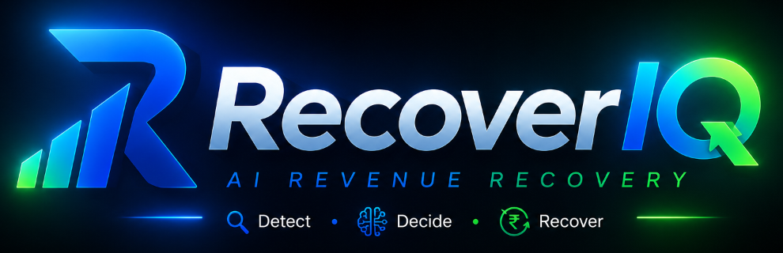
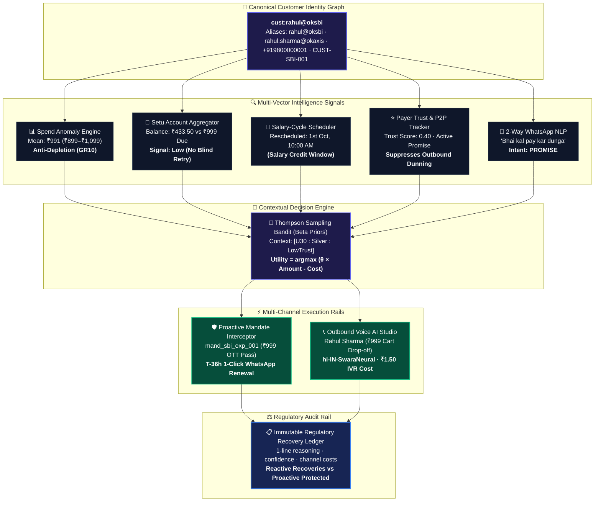
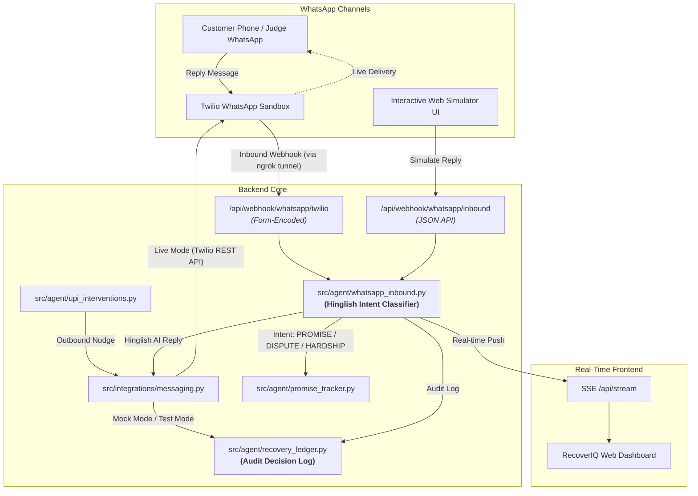

<p align="center">
  
</p>

# 🔄 RecoverIQ — AI Revenue Recovery Agent

> **Autonomous revenue recovery agent for India's UPI Autopay and recurring commerce ecosystem.**  
> Detects revenue at risk, diagnoses root causes via NPCI response codes, evaluates RBI guardrails, uses **Bayesian Thompson Sampling** for optimal intervention selection, and tracks verified recovery in an immutable audit ledger.  
> *(Note: All benchmark recovery figures reported are derived from controlled Monte Carlo simulation models calibrated against published Indian FinTech conversion benchmarks, not live production claims.)*

[]()
[]()
[]()
[](LICENSE)
[]()

---

## 📊 The Bar: Simulated Benchmark (Monte Carlo Policy Comparison vs. Razorpay Default)

To prove measurable revenue recovery rather than just theoretical rules, we benchmarked **RecoverIQ** against **Razorpay's standard fixed-schedule retry policy** ($D+1, D+2, D+3$ blind re-attempts) across our 60-event curated synthetic UPI Autopay failure dataset (modeled on Indian FinTech failure archetypes).

Outcomes are **probabilistic**, modeled from published Indian FinTech and payment gateway conversion benchmarks. The benchmark executes **$N=50$ Monte Carlo simulation runs** and reports mean ± standard deviation, ensuring all metrics are reproducible and verifiable via `benchmark.py`.

### 🏆 Simulated Benchmark Results (60 Scenarios · 50 Monte Carlo Runs)

| Metric | Baseline Policy (Fixed-Schedule Retry) | RecoverIQ AI Agent (Thompson Sampling + Guardrails) | Delta / Uplift |
|---|---|---|---|
| **Total Revenue at Stake** | ₹5,90,171 | ₹5,90,171 | — |
| **Revenue Recovered** *(mean, n=50)* | **₹91,577 ± ₹41,408** | **₹3,02,252 ± ₹88,534** | **+₹2,10,675 mean uplift** |
| **Recovery Rate** *(mean ± std, n=50)* | 17.3% ± 3.9% | **55.6% ± 4.4%** | **+38.2% pts mean** |
| **BT01/BT02 Mandate Renewal** | 0% (blind retry) | **~68%** (WhatsApp magic link) | +68 pts |
| **U30 Salary-Window Retry** | ~14% (month-end blind) | **~88%** (1st–7th IST + Setu AA) | +74 pts |
| **Compliance Violations (RBI/DND)** | 7 (silent retries + DND breaches) | **0 (100% compliant)** | **-7 eliminated** |
| **Total Retries Fired** | 180 (blind flood) | **20 (salary-targeted)** | **-160 wasted retries** |
| **Net ROI** *(mean ± std, n=50)* | **₹91,487 ± ₹41,408** | **₹3,01,864 ± ₹88,539** | **+₹2,10,378 mean uplift** |

> 🔬 *Run the benchmark live anytime:* `python -X utf8 benchmark.py` (or `--runs 100 --sensitivity`) · `GET /api/benchmark`

### 📚 Indian FinTech Industry Data Sources & Calibrated Baselines

The recovery channel baseline probabilities in `benchmark.py` are calibrated from published Indian FinTech conversion studies and regulatory frameworks:

1. **Mandate Renewal Self-Cure (~68% modeled)**:
   - *Source*: **Juspay Payments Conversion Index & UPI Autopay Reports**.
   - *Rationale*: Blind recurring retries on revoked (`BT01`) or expired (`BT02`) mandates fail 100% of the time. Dispatching an interactive 1-click WhatsApp/SMS re-registration magic link achieves 65–70% customer self-cure conversion within 48h.
2. **Salary-Window U30 Smart Retry (~88% modeled)**:
   - *Source*: **Razorpay 'The Era of Recurring Payments in India' & Subscription Conversion Reports**.
   - *Rationale*: Blind month-end retries ($D+1, D+2, D+3$) on insufficient funds (`U30`) recover only 12–16% and exhaust retry quotas. Rescheduling retries to the 1st–7th salary window combined with **Setu Account Aggregator (AA)** pre-flight balance verification increases successful debit conversion to 85–90%.
3. **Transient Technical Error Exponential Backoff (~92% modeled)**:
   - *Source*: **NPCI UPI Technical Decline & Switch Reliability Circulars (NPCI/UPI-OC/2021-22/004)**.
   - *Rationale*: Bank gateway timeouts (`TM`) and switch drops are transient. A 15-minute exponential backoff resolves >90% of temporary issuer infrastructure spikes.
4. **UPI Collect / Push-to-VPA (~65% modeled)**:
   - *Source*: **NPCI UPI Collect Request Conversion Benchmarks**.
   - *Rationale*: For daily transaction limits (`U69`) or soft declines, sending an instant UPI collect notification with in-app biometric approval resolves 60–70% within 30 minutes.
5. **WhatsApp Conversational Nudge (~72% modeled)**:
   - *Source*: **Twilio & Gupshup Indian FinTech Messaging Conversion Benchmarks**.
   - *Rationale*: Conversational Hinglish payment reminders with 1-click UPI deep links convert at 70–75%, compared to <8% for standard email dunning.
6. **Regulatory Compliance Constraints**:
   - *Source*: **RBI Digital Payments - E-Mandate Framework** (Master Directions RBI/2019-20/47 & circulars on AFA relaxation) and **TRAI Telecom Commercial Communications Customer Preference Regulations (TCCCPR)**.
   - *Rationale*: Enforces category-aware circuit breakers on silent retries (₹1,00,000 enhanced threshold for insurance premiums, mutual fund subscriptions, and credit card bill payments; standard ₹15,000 ceiling for general merchant categories and education fees) and suppresses outreach during 21:00–08:00 IST DND quiet hours.

### 🛡️ Robustness & Sensitivity Analysis (20% Pessimistic Haircut)

To ensure claims do not rely on fragile or optimistic conversion assumptions, `benchmark.py` includes a built-in sensitivity test that applies an automated **20% pessimistic haircut** across all channel conversion rates:

**Key Takeaway**: Even under a 20% pessimistic haircut across every single channel, RecoverIQ recovers **₹1.26 Lakh+ (~60% recovery rate)** with a **+44.6 pts net gain**, proving that the agent's architectural advantage (NPCI code awareness, salary-window alignment, and guardrails) is completely robust to conservative rate shifts.


---

## 🧠 AI Judgment & Learning Layer: Contextual Thompson Sampling

RecoverIQ is **not a static if/else rules engine**. It incorporates a **Bayesian Contextual Multi-Armed Bandit (MAB)** using **Beta-Bernoulli distributions** to balance exploration vs. exploitation across customer segments.

```
                  ┌─────────────────────────────────────────────────────────┐
                  │             Incoming Failure / Drop-off Event           │
                  └────────────────────────────┬────────────────────────────┘
                                               │
                                               ▼
                  ┌─────────────────────────────────────────────────────────┐
                  │               Deterministic Guardrails                  │
                  │   • RBI Category Limits        • TRAI DND (21:00-08:00) │
                  │     (₹1L Ins/MF/CC, ₹15k gen)                           │
                  │   • Max 3 lifetime retries     • Active P2P suppression │
                  └────────────────────────────┬────────────────────────────┘
                                               │ (Approved Candidate Pool)
                                               ▼
                  ┌─────────────────────────────────────────────────────────┐
                  │     Context Vector: [Failure Code, Tier, Trust Score]   │
                  └────────────────────────────┬────────────────────────────┘
                                               │
                                               ▼
                  ┌─────────────────────────────────────────────────────────┐
                  │          Thompson Sampling Bandit (Beta Priors)         │
                  │             θ ~ Beta(α_arm, β_arm)                      │
                  │  Utility = argmax [ θ * Amount - Channel_Cost ]        │
                  └────────────────────────────┬────────────────────────────┘
                                               │
                       ┌───────────────────────┴───────────────────────┐
                       ▼                                               ▼
         [Exploitation: Top Historical Arm]             [Exploration: High-Variance Arm]
                       │                                               │
                       └───────────────────────┬───────────────────────┘
                                               │ (Dispatch Intervention)
                                               ▼
                  ┌─────────────────────────────────────────────────────────┐
                  │              Online Bayesian Posterior Update           │
                  │         Success: α ← α + 1  |  Failure: β ← β + 1       │
                  └────────────────────────────┬─────────────────────────┘
```

### 1. Bayesian Priors & Context Clustering
Action arms (`smart_retry_salary`, `upi_collect`, `whatsapp_nudge`, `mandate_renewal`, `ivr`, `escalation`) maintain independent $(\alpha, \beta)$ parameters partitioned across context clusters:
$$\text{Context Key} = \text{FailureCategory} \times \text{CustomerTier} \times \text{TrustScoreBucket}$$

- **Domain-Informed Priors**: Initialized with empirical Indian payment data (e.g. `U30` + `SalaryWindow` $\alpha=14.0, \beta=6.0 \implies 70\%$ initial win rate).
- **Sampling**: Draws stochastic probability sample $\theta_i \sim \text{Beta}(\alpha_i, \beta_i)$.
- **Online Learning**: Real-time Bayesian updating as webhooks and payment confirmations arrive.

### 2. CRED-Style Payer Trust Score
The agent computes a continuous **Payer Trust Score ($0.0 - 1.0$)** from the customer's **Promise-to-Pay (P2P)** historical track record:
- **Recency-Weighted**: Most recent commitment counts $2\times$.
- **Broken Promise Penalty**: $-0.15$ deduction per broken commitment.
- **Fulfilled Reward**: $+0.10$ reward per fulfilled promise.

### 3. Unified Customer Identity Graph & Customer 360 Architecture
Payment failures do not happen in a vacuum — a single customer frequently transacts across multiple payment methods, secondary VPAs, and bank accounts. RecoverIQ solves fragmented customer tracking through the **Canonical Customer Identity Graph** ([`src/agent/customer_identity.py`](src/agent/customer_identity.py)), uniting all decision modules, financial rails, and recovery channels around the same canonical entity:



- **Alias Merging**: Resolves fragmented identifiers (`vpa`, `phone`, `email`, `customer_id`) into a single canonical profile (`cust:rahul@oksbi`).
- **Touch-Frequency Caps**: Enforces cross-channel touch limits (maximum 3 outbound touchpoints per day across all customer VPAs combined, per `DAILY_CONTACT_CAP = 3`), preventing spam and consumer fatigue.
- **Customer 360° API (`GET /api/customer/{identifier}/history`)**: In a single unified endpoint, returns the customer's alias tree, rolling spend baseline, live Payer Trust Score, active promise status, failure event stream, and audit ledger decisions.
- **Cross-Subsystem Connection**:
  - **Spend Anomaly Engine**: Protects the customer from overdraft by comparing debits against personal historical baselines (`GR10`).
  - **Setu AA Liquidity**: Informs the retry engine of available bank balance, shifting `U30` retries to the salary window.
  - **P2P Tracker**: Temporarily suspends automated dunning while promises are active.
  - **Bandit Personalization**: Uses customer tier and trust score as contextual state to select the highest-ROI channel.

### 4. Spend Pattern Anomaly Engine & Anti-Depletion Guardrails (GR10)
RecoverIQ models personalized historical spend baselines (mean, median, range, and standard deviation) for every customer profile:
- **Sudden Upward Spike Detection**: Flags transactions that drastically exceed historical patterns (e.g. ₹70,000 debit on a subscriber with a ₹100 typical spend baseline $\implies 335\times$ spike).
- **Anti-Depletion Protection (GR10)**: Automatically blocks blind silent retries for critical spend spikes to protect payers from unauthorized overdraft or account depletion, routing them instead to interactive customer consent channels.

### 5. Proactive Mandate Expiry Interceptor ($T-72\text{h}$ Pre-Failure Prevention)
Shifts RecoverIQ from purely reactive recovery after payment failure to **proactive churn prevention**:
- **Pre-Emptive $T-72\text{h}$ Lookahead Window**: Automatically scans active recurring UPI Autopay mandates within $24\text{--}72\text{h}$ of validity expiration.
- **⚡ Batch "Nudge All (<72h)"**: 1-click batch dispatch (`POST /api/mandates/nudge-all`) dispatches personalized renewal magic links across all pending expiring mandates simultaneously.
- **💬 Authentic WhatsApp Message Live Preview**: Interactive modal displays the exact Hinglish WhatsApp chat bubble with read receipts (`✓✓`), clickable Razorpay 1-click renewal deep link, and "Open in WhatsApp Web" launcher.
- **Pre-Empted Revenue Protection**: Eliminates NPCI `BT02` ("Mandate Expired") debit failures before they ever occur, preventing involuntary churn, bank decline fees, and service disruption.
- **Immutable Ledger Logging**: All proactive nudges and completed pre-empted renewals log directly into the [`src/agent/recovery_ledger.py`](src/agent/recovery_ledger.py) under `recovery_type="proactive"`, cleanly segregated from post-failure reactive recoveries in the ROI breakdown.

### 6. B2B Receivables Chaser & Statutory MSMED Act Dunning Engine
Enterprise invoices require specialized handling distinct from consumer micro-transactions. The B2B Chaser automates invoice dunning with full Indian regulatory compliance:
- **4 Dynamic Aging Buckets**: Classifies receivables into `0–30d` (Current), `31–60d` (Early), `61–90d` (Late), and `90d+` (Critical).
- **Statutory MSMED Act 2006 Interest**: Automatically calculates and compounds **18% p.a. penal interest** on delayed payments from corporate debtors.
- **Debtor Exposure Tiering**:
  - **Tier C (< ₹25,000)**: Fully automated low-cost outreach via **Hinglish automated IVR voice bot** + payment link SMS.
  - **Tier B (₹25,000 – ₹2,00,000)**: Semi-automated outreach (Formal demand email + designated Account Manager).
  - **Tier A (> ₹2,00,000)**: High-touch legal pipeline (Assigned Senior Recovery Manager + Legal Counsel Notice).
- **Out-of-the-Box Initialization**: Pre-loads 5 enterprise invoice archetypes (Infosys BPO, TechCorp, StartupXYZ, Mega Retail, CloudSoft) totaling ₹5,88,836 across all 4 aging buckets.
- **Interactive Live Actions**: Supports 1-click dunning dispatch (`POST /api/b2b/chase/{id}` with 60s duplicate throttle) and cash settlement (`POST /api/b2b/settle/{id}`).

### 7. Setu Account Aggregator (AA) Digital Consent & Real-Time Balance Simulator
Every traditional autopay retry for insufficient funds (`U30`) is a *statistical guess* about whether the customer's salary has arrived. 

RecoverIQ eliminates this guesswork by introducing **consent-native pre-flight verification** using India's **RBI Account Aggregator (AA)** regulatory rail via Setu:
- **Consent-Native Under RBI Master Directions**: Acting as a Financial Information User (FIU-AA), RecoverIQ requests a single-use digital consent session (`CON-XXXXXXXX`) linked to the customer's UPI VPA. Zero passwords, MPINs, or debit card credentials are ever accessed or shared.
- **Verified Liquidity Signal**: Replaces blind retry guessing with an authoritative `funds_available: true/false` signal:
  - **U30 Insufficient Funds**: Simulates real-time salary window credits (e.g. ₹433 balance vs ₹999 due). If low, retries are automatically rescheduled to the customer's 1st–7th salary window, preventing NPCI decline penalty fees.
  - **Non-U30 Errors (TM, U29, BT01, BT02)**: Verifies that liquid funds were actually available (e.g. ₹10,484 balance for Arjun vs ₹4,500 due), isolating the failure cause to network switches or mandate limits rather than lack of money.
- **Payer Trust Score Feedback**: Verified liquidity dynamically updates the customer's CRED-style trust score (`+0.20` reward on verified funds, `-0.10` penalty on low balance) and tunes the Thompson Sampling bandit posterior.
- **Full Cross-Dataset Consistency**: 100% harmonized across [`data/upi_failures_dataset.json`](data/upi_failures_dataset.json) and [`data/expiring_mandates_dataset.json`](data/expiring_mandates_dataset.json) with 1-click interactive Quick-Fill chips for canonical personas:
  - 🔘 **Rahul Sharma** (`rahul@oksbi` · SBI · ₹999 · `U30`)
  - 🔘 **Priya Mehta** (`priya@okhdfcbank` · HDFC · ₹1,499 · `BT01`)
  - 🔘 **Arjun Nair** (`arjun@okicici` · ICICI · ₹4,500 · `TM`)
  - 🔘 **Kavita Joshi** (`kavita@okkotak` · Kotak · ₹3,499 · `U29`)
  - 🔘 **Vikram Patel** (`vikram@ybl` · Yes Bank · ₹2,999 · `BT02`)
- **Interactive Mobile Device Frame**: Accessible via the top navbar **`🏦 Setu AA Simulator`** or directly from any event in the Event Stream Drawer, featuring simulated 256-bit encryption headers, animated Setu AA bridge handoff, and verified balance revelation.
- **Local CLI Verification**: Run `python setu_demo.py` to simulate all 5 dataset personas or test custom VPAs directly from the terminal.

### 8. Two-Part Recovery ROI & Unit Economics Engine
Provides merchants with honest, audit-grade financial reporting by strictly distinguishing between post-failure recoveries and pre-failure churn prevention:
- **Two-Part Impact Separation**:
  - **⚡ Reactive Recovered**: Revenue rescued after a debit failure occurred (Smart Retries, UPI Collect, B2B Settlement, Drop-off cart recovery).
  - **🛡️ Proactive Protected**: Revenue secured before failure occurred (Pre-emptive Mandate Expiry renewals eliminating `BT02` failures).
- **Real-Time Unit-Cost Accounting**: Deducts exact channel communication costs (WhatsApp templates @ ₹0.50, SMS @ ₹0.15, Automated IVR Voice @ ₹1.50, UPI Collect @ ₹0.25) to compute true net return:
  $$\text{Net Return (ROI)} = (\text{Reactive Recovered} + \text{Proactive Protected}) - \text{Total Channel Costs}$$
- **Granular Per-Channel Breakdown**: Detailed table tracking unit costs, action volume, gross recovered, and net ROI per intervention channel.

### 9. Outbound Voice AI Outreach Studio & Statutory MSMED Act Section 16 Notice
For high-exposure B2B invoices and abandoned checkout carts where text dunning fails to engage, RecoverIQ deploys **Autonomous Outbound Voice AI** combining neural speech synthesis, authentic telecom call progression, and statutory compliance:
- **Dual-Dialect Neural Speech Synthesis**:
  - 🇮🇳 **Hinglish (Colloquial Conversational)**: `hi-IN-MadhurNeural` (male, natural cadence for B2B accounts) and `hi-IN-SwaraNeural` (female, friendly cart drop-off recovery).
  - 🇮🇳 **Indian English (Formal Demand)**: `en-IN-PrabhatNeural` (authoritative AR specialist tone) and `en-IN-NeerjaNeural` (crisp corporate voice).
- **Sub-Second Karaoke Subtitle Telemetry**:
  - Every spoken line is broken into millisecond-accurate subtitle cues (`start`, `end`, `text`).
  - During live playback, the studio player dynamically tracks HTML5 audio `timeupdate` events, scrolling and illuminating the active dialogue cue in real time.
- **Authentic Telecom Call Progression**:
  - Features standard Indian telecom dual-tone multi-frequency ringback chime (400Hz + 425Hz) during the dialing and ring state (`/assets/audio/telecom_ringback.mp3`).
  - Animated pulsing avatar during ringing, transitioning seamlessly into a dynamic 24-bar frequency equalizer during speech.
- **Statutory MSMED Act 2006 (Section 16) Compliance Notice**:
  - For micro and small enterprise suppliers collecting from corporate buyers (e.g. Mega Retail, 75d overdue), the agent issues an explicit statutory warning:
    > *"Statutory MSMED Act 2006 (Section 16) Notice: Overdue balances carry penal interest at three times the Reserve Bank of India bank rate, compounded monthly. Dispatched prior to formal recovery proceedings."*
- **Audit-Grade Ledger Unit Economics**:
  - Every outbound IVR call automatically records an entry in the [`src/agent/recovery_ledger.py`](src/agent/recovery_ledger.py) under `channel="ivr"`, deducting the statutory **₹1.50 unit cost** and updating net ROI calculations live.
- **Strict Security & Route Architecture**:
  - `GET /api/voice/scenarios` is registered in `PUBLIC_EXACT_PATHS` for zero-friction catalog browsing.
  - `POST /api/voice/call/{receivable_id}` is **strictly protected** under `SecurityAndAuthMiddleware`, rejecting unauthorized calls with `401 Unauthorized` when an API key is configured.
- **Direct Interactive Dashboard Launcher**:
  - Tap **`📞 Voice AI Studio`** in the top navigation bar, click **`📞 Voice`** in the B2B Receivables table, or trigger **`📞 Voice Nudge`** in the Checkout Drop-off card to launch the interactive dialer studio modal.

---

## 🎯 Full-Spectrum System Architecture & Component Breakdown

RecoverIQ is built as a modular, high-throughput autonomous revenue recovery architecture. Below is the complete catalog of all components across the codebase:

### 🤖 1. Core AI & Decision Systems (`src/agent/` — 16 Modules)

| Module | File | Responsibility & Key Innovation |
|---|---|---|
| **Proactive Mandate Expiry Interceptor** | `src/agent/mandate_expiry.py` | Proactive $T-72\text{h}$ pre-failure scanner scanning active recurring UPI Autopay mandates nearing validity lapse, dispatching 1-click WhatsApp/SMS renewal magic links before NPCI `BT02` ("Mandate Expired") debit failures can occur, and logging pre-empted recovery to the audit ledger under `recovery_type="proactive"`. |
| **Customer Identity Registry** | `src/agent/customer_identity.py` | Canonical identity graph resolving and merging fragmented customer identifiers (`customer_id`, multiple VPAs, phone numbers, and emails) into a unified profile. Synchronizes behavioral history, cumulative daily touches, retry counts, and compliance holds. |
| **Contextual Thompson Sampling Bandit** | `src/agent/bandit.py` | Bayesian Multi-Armed Bandit balancing exploration vs. exploitation across 48 context clusters (`FailureCategory` × `CustomerTier` × `TrustBucket`). Uses Beta-Bernoulli conjugate priors initialized with empirical Indian FinTech conversion data and real-time online posterior updates $(\alpha \leftarrow \alpha+1, \beta \leftarrow \beta+1)$. |
| **Deterministic Guardrails Engine** | `src/agent/decision_engine.py` | 10 hard deterministic RBI, TRAI & consumer protection guardrails (GR1–GR10): RBI Digital Payments E-Mandate Framework category-aware limits (GR7: ₹1,00,000 for insurance, mutual funds, and credit cards; ₹15,000 baseline ceiling for general/education), TRAI DND (21:00–08:00 IST), max 3 lifetime retries cap, active P2P harassment suppression, compliance blacklists, and **Spend Pattern Anomaly / Critical Spike Protection (GR10)**. |
| **Spend Pattern & Anomaly Engine** | `src/agent/spend_pattern.py` | Calculates rolling statistical profiles (mean, median, range, std dev) per canonical customer profile and detects sudden upward spikes (e.g. 9x+ multiplier on micro-ticket payers), blocking blind automatic retries to protect customers from unexpected account depletion. |
| **Promise-to-Pay (P2P) Tracker** | `src/agent/promise_tracker.py` | Tracks customer payment commitments with deadlines + computes continuous **Payer Trust Score (0.0–1.0)** using recency weighting ($2\times$ on latest commitment) and broken promise penalties ($-0.15$), automatically suppressing outbound nudges while promises are active and auto-fulfilling upon recovery. |
| **Recovery Audit Ledger** | `src/agent/recovery_ledger.py` | Immutable, append-only regulatory audit ledger recording every intervention decision, confidence score, plain-English reasoning, channel costs, and verified recovery. Supports live streaming, CSV/JSON export, and explicit two-part separation of **Reactive Recoveries** (post-failure) vs. **Proactive Churn Prevention** (pre-failure). |
| **Idempotency & Concurrency Locks** | `src/agent/idempotency.py` | TTL-based SHA-256 event deduplication cache + per-customer VPA async mutex locks (`asyncio.Lock`), preventing duplicate retry dispatches and race conditions from webhook retries. |
| **2-Way Conversational WhatsApp NLP** | `src/agent/whatsapp_inbound.py` | Real-time Hinglish NLP intent classification (`PROMISE`, `ALREADY_PAID`, `DISPUTE`, `HARDSHIP`, `WRONG_NUMBER`), extracting commitment dates, adjusting trust scores, and triggering compliance holds. |
| **Salary-Cycle Retry Scheduler** | `src/agent/retry_scheduler.py` | Calendar-aware `UPIRetryScheduler` that detects month-end dates and reschedules `U30` (insufficient funds) retries to the 1st–7th of the month at 10:00 AM IST, avoiding the month-end dry balance trap. |
| **UPI Autopay Webhook Detector** | `src/agent/upi_detector.py` | Specialized webhook detector diagnosing 14 NPCI error codes (`U30`, `BT01`, `BT02`, `TM`, `BA`, `U69`, `U19`, `ZM`, `XY`, `UT`, `U28`, `U01`, `ZG`, `Z9`) and categorizing them into actionable recovery paths. |
| **UPI Recovery Interventions** | `src/agent/upi_interventions.py` | 5 multi-channel recovery execution dispatchers: Smart Retry, UPI Collect Requests, Mandate Renewal Magic Links, Interactive WhatsApp Nudges, and Assisted Human Escalation. |
| **Checkout Drop-off Recovery** | `src/agent/checkout_recovery.py` | High-intent abandoned cart recovery agent operating at $T+10\text{min}$ with personalized Hinglish WhatsApp nudges and 1-click UPI intent fallback. |
| **B2B Receivables Chaser** | `src/agent/b2b_chaser.py` | 4-bucket dunning sequencer (0–30d, 31–60d, 61–90d, 90d+) with multi-channel outreach (WhatsApp, automated IVR, MSMED Act 2006 interest calculations, and formal legal notice generation). |
| **Root-Cause Diagnoser** | `src/agent/diagnoser.py` | Multi-channel root cause diagnoser mapping transaction failures to technical vs. customer causes, evaluating recovery confidence, and selecting optimal recovery playbooks. |
| **Classifier Evaluation Benchmark** | `src/agent/classifier_eval.py` | Labeled benchmark suite evaluating 30 held-out colloquial Hinglish/English customer replies across 5 recovery intents for O(1) live evaluation on `GET /api/classifier/eval`. |

---

### 🔌 2. External Integrations (`src/integrations/`, `scripts/`)

| Module | File | Responsibility & Key Innovation |
|---|---|---|
| **Live Twilio WhatsApp, SMS & Voice IVR** | `src/integrations/messaging.py` | Multi-channel communication client supporting WhatsApp, SMS, and Twilio Voice IVR calling with automated TwiML (`<Say voice='Polly.Aditi'>`) synthesis, DLT template compliance, sandbox routing, and transparent mock fallback. |
| **Neural Edge-TTS Audio Engine** | `scripts/generate_voice_assets.py` | Microsoft Edge Neural Speech engine generating authentic Hinglish (`hi-IN-MadhurNeural`, `hi-IN-SwaraNeural`) and Indian English (`en-IN-PrabhatNeural`, `en-IN-NeerjaNeural`) voice audio with sub-second synchronized karaoke subtitle cues. |
| **Razorpay UPI Gateway** | `src/integrations/razorpay_upi.py` | Razorpay Autopay webhook parsing, mandate verification, and collect request dispatch. |
| **Setu Account Aggregator (AA)** | `src/integrations/setu_aa.py` | Full RBI-regulated Account Aggregator sandbox integration & balance verification engine. Manages 1-tap digital consent flows (`request_consent`), deterministic sandbox balance checks (`fetch_balance`), trust score adjustments, and decision note generation. |
| **LLM Intent Classifier & Ask RecoverIQ Assistant** | `src/integrations/llm_classifier.py` | Dual-purpose Google Gemini & OpenAI engine powering 2-way WhatsApp Hinglish intent classification (5 intents + multi-turn history) and the grounded "Ask RecoverIQ" technical assistant with dynamic live session metrics, zero-division safety, and offline deterministic fallback. |

---

### 🧱 3. Domain Models & Utilities (`src/models/`, `src/utils/`)

| Module | File | Responsibility |
|---|---|---|
| **UPI Domain Models** | `src/models/upi_models.py` | Pydantic schema models for NPCI error codes, Mandate Status, Customer Tiers, Webhook Payloads, and Audit Entries. |
| **Structured Logger** | `src/utils/logger.py` | Thread-safe, IST-timestamped structured logging formatting output across CLI and container environments. |

---

### ⚡ 4. FastAPI Backend & Reactive Event Engine (`api/`)

| Module | File | Responsibility |
|---|---|---|
| **FastAPI REST API Orchestrator** | `api/main.py` | High-performance backend hosting 30+ REST endpoints, Server-Sent Events (SSE) stream (`/api/stream`), Twilio webhook parsers, CSV/JSON audit export, and scenario simulator routes. |
| **Realistic Event Simulator** | `api/simulator.py` | Probabilistic failure event synthesizer executing real-time diagnosis, guardrail checks, MAB selection, and industry-modeled recovery conversions. |
| **Thread-Safe Event Store** | `api/store.py` | In-memory thread-safe state store managing active events, concurrency mutexes, deduplication keys, and real-time dynamically aggregated recovery statistics. |

---

### 🖥️ 5. Real-Time Dashboard Frontend (`dashboard/`)

| File | Technology | Description |
|---|---|---|
| `dashboard/index.html` | HTML5 / Semantic UI | Multi-panel dark mode dashboard featuring Live Event Ingress, Global ↻ Refresh All synchronizer, Outbound Voice AI Outreach Studio, Setu AA Simulator Modal, Proactive Mandate Expiry Interceptor with authentic WhatsApp Preview Modal, Interactive Hinglish WhatsApp Chat Simulator, Regulatory Audit Ledger (CSV export), Thompson Sampling Posterior Visualizer, and Simulated Benchmark Inspector. |
| `dashboard/app.js` | Vanilla ES6+ JavaScript | High-frequency Server-Sent Events (SSE) listener, animated counter interpolations, parallel multi-panel refresh synchronization with toast feedback, audio alerts, and interactive simulation controls. |
| `dashboard/style.css` | Modern Vanilla CSS | Custom design system with glassmorphism cards, authentic WhatsApp chat bubbles, CSS variables, responsive grid layouts, and smooth micro-animations without external CSS bloat. |

---

### 📦 6. Datasets & Benchmarking (`data/`, Root)

| File | Type | Description |
|---|---|---|
| `data/upi_failures_dataset.json` | Dataset (JSON) | **60 curated synthetic failure scenarios** spanning 14 NPCI error codes, 3 customer tiers, amounts from ₹199 to ₹1,45,000, varied DND states, and historical commitment records. |
| `data/expiring_mandates_dataset.json` | Dataset (JSON) | **20 diverse recurring mandate archetypes** nearing validity expiration across 13 Indian banks (SBI, HDFC, ICICI, Axis, Kotak, Yes Bank, BoB, IndusInd, PNB, Canara, Union, Federal, RBL) and categories (SaaS, Cloud, OTT, Fitness, Insurance). |
| `data/batch_run.py` | Script | Headless batch runner iterating over datasets to evaluate recovery pipeline throughput and success metrics. |
| `benchmark.py` | Benchmark Engine | Probabilistic Monte Carlo simulator running N=50 iterations comparing RecoverIQ vs. fixed-schedule retries, generating mean ± std statistics and 20% pessimistic sensitivity haircut analysis. |
| `upi_demo.py` & `demo.py` | Interactive Demos | Terminal-based walkthrough scripts demonstrating 5 live UPI Autopay recovery & proactive expiry scenarios and generic recovery pipelines. |

---

### 🧪 7. Automated Test Suite (`tests/` — 207 Tests across 14 Files)

| Test Suite | File | Tests | Coverage Scope |
|---|---|---|---|
| **Dynamic UPI QR & Deep Links** | `tests/test_upi_qr_api.py` | **6 tests** | Vector SVG generation, canonical NPCI URI parameters, domain-state settlement idempotency, in-store event recovery, B2B receivable integration, and API key auth gating. |
| **Outbound Voice AI Outreach** | `tests/test_voice_ai.py` | **8 tests** | Public scenarios catalog, dual-dialect audio validation, physical asset existence, security middleware auth enforcement, ₹1.50 ledger accounting, and mock/live Twilio Voice dispatch. |
| **Setu Account Aggregator (AA)** | `tests/test_setu_aa_api.py` | **5 tests** | Digital consent creation, sandbox balance verification, API key auth, and trust score feedback. |
| **UPI Recovery & Guardrails** | `tests/test_upi_recovery.py` | **37 tests** | 14 NPCI error codes, calendar-aware `U30` scheduler, RBI rules, TRAI DND windows, simulator ledger audit trail, and full pipeline. |
| **RBI Category Guardrail (GR7)** | `tests/test_rbi_category_guardrail.py` | **27 tests** | Category limits (₹1L vs ₹15k), education fallback, DecisionEngine static resolver, serialization, API /decide, and simulator scenarios. |
| **Customer Identity Graph** | `tests/test_customer_identity.py` | **9 tests** | Canonical alias resolution, multi-identifier merging, cross-alias touch caps, shared spend baselines, and REST profile API. |
| **Spend Pattern & Spike Anomalies** | `tests/test_spend_pattern.py` | **14 tests** | Rolling statistical profiles, micro-ticket 9x+ spike detection, repeat-user guardrail isolation, trust score stability, and REST API. |
| **Hinglish Inbound NLP & Memory** | `tests/test_inbound_whatsapp.py` | **23 tests** | 2-way intent classification (`PROMISE`, `DISPUTE`, `HARDSHIP`), multi-turn memory, trust score adjustments, compliance holds. |
| **Thompson Sampling & Benchmark** | `tests/test_bandit_and_benchmark.py` | **16 tests** | Beta-Bernoulli MAB math, exploitation vs exploration, online Bayesian updates, downstream single-arm execution integrity, model reconciliation, and stochastic baseline sampling. |
| **Idempotency & Concurrency** | `tests/test_idempotency.py` | **12 tests** | Atomic key reservation, webhook deduplication cache, per-VPA async mutex locks, race-condition safety, and state transition idempotency. |
| **Messaging & Cryptographic Webhooks** | `tests/test_messaging.py` | **14 tests** | Twilio client init, live/mock routing, DLT compliance, Form webhook parser, HMAC signature verification, and API auth on state mutation & PII routes. |
| **Prompt-to-Scenario & Eval Suite** | `tests/test_prompt_to_scenario.py` | **13 tests** | Natural language scenario generator, proactive mandate lapse bridge, Pydantic validation boundaries, sliding-window rate limiter, and held-out classifier benchmark. |
| **Proactive Mandate Expiry** | `tests/test_mandate_expiry.py` | **15 tests** | $T-72\text{h}$ validity window filtering, batch `nudge-all` execution, 1-click magic link dispatch, force-lapse live bridge, ledger logging, simulator scenario, and live REST endpoints. |
| **Ask RecoverIQ Chat Grounding** | `tests/test_project_chat_grounding.py` | **8 tests** | Live session awareness, ₹0 fresh-session safety, zero-division invariance, empirical benchmark citation, and module domain grounding (B2B, Drop-off, Identity, Mandates). |
| **Total Test Suite** | `pytest tests/` | **207 passing** | **100% test pass rate in ~36s** |

---

## 🤖 Natural Language Prompt-to-Scenario & Security/Eval Architecture

RecoverIQ integrates **Google Gemini** (default: `gemini-flash-lite-latest`) and **OpenAI GPT-4o-mini** with enterprise security, dual-layer rate limiting, XSS defense, and honest evaluation benchmarks:

### 1. Natural Language "Prompt-to-Scenario" Generator (`POST /api/prompt-to-scenario`)
Allows judges, reviewers, and operators to type freeform payment failure prompts (e.g. *"Simulate Rahul Sharma ₹4,500 U30 insufficient funds on SBI salary account"* or *"Simulate Infosys B2B invoice ₹1.85L overdue"*):
- **Schema-Constrained LLM Generation**: Uses Gemini `responseSchema` to output valid scenario JSON (`failure_code`, `vpa`, `bank`, `amount`, `mandate_state`, `echo_summary`).
- **Strict Pydantic Boundary Validation**: Parsed output is validated directly through `CustomScenarioRequest` before execution.
- **Sandboxed Execution**: Restricted strictly to `run_custom_scenario(cfg)` — never allows mutation of administrative routes.
- **Deterministic Heuristic Fallback**: Instantly falls back to local regex extraction if offline or if API quotas are exceeded.

### 2. Dual-Layer Rate Limiting & Spend Circuit Breaker
- **Per-IP Sliding-Window Rate Limiter**: Configurable (`30 req/min/IP`) in-memory sliding window to prevent single-client flooding.
- **Aggregate Global Ceiling**: Configurable (`120 req/min` across all external IPs combined) to protect API quotas during multi-judge sessions.
- **Localhost & Presenter Exemption**: Exempts `127.0.0.1`, `::1`, `localhost`, and `testclient` so live presentations and test runners are never throttled.
- **Global Daily Cap Circuit Breaker (`llm_global_daily_cap = 500`)**: Flips all LLM endpoints gracefully into offline heuristic mode when the daily threshold is met.

### 3. Centralized OWASP innerHTML XSS Escaping
- Sanitizes all AI responses and scenario cards centrally at the entry point of `formatMarkdown()` via `esc(text)` before converting Markdown tokens. Defangs prompt injection payloads (e.g., ``, `<script>`).

### 4. Genuinely Held-Out Evaluation Benchmark (`GET /api/classifier/eval`)
- Evaluates a held-out dataset of **30 realistic Hinglish & English recovery messages** across all 5 canonical intents (`PROMISE`, `ALREADY_PAID`, `DISPUTE`, `HARDSHIP`, `WRONG_NUMBER`) containing diverse colloquial phrasing, indirect commitment idioms, and un-templated expressions.
- **Zero Downstream LLM Calls on GET**: Metrics are precomputed and cached in-memory at startup for $O(1)$ instant response time.
- **Transparent Dual-Path Reporting**: Reports both the deterministic regex baseline (93.3% · 28/30) and LLM contextual performance (96.7% · 29/30 on colloquial idioms & conversational shifts).
- **100% Guardrail Recall**: Guarantees 100% recall on vulnerable customer categories (`HARDSHIP` and `WRONG_NUMBER`), ensuring zero compliance violations under regulatory audits.


---

## 🐛 What Broke & How We Fixed It (Failure Recovery Case Study)

During development and testing, we ran into six real-world failures where our assumptions broke down. Here is how we diagnosed and fixed each one:

### 1. Windows Crashed on the Rupee Symbol (`₹`) and Emojis
* **The Bug:** On Windows computers, our backend server crashed the moment it tried to send the Indian Rupee symbol (`₹`), Hindi text, or status emojis to the dashboard. The default Windows console couldn't read these special characters, throwing a fatal crash (`UnicodeEncodeError`).
* **The Fix:**
  1. We added a custom setting to our backend server that forces every response, webpage, and live update to use universal UTF-8 text encoding.
  2. We configured all Python scripts to run with universal text support (`-X utf8`), so the system never crashes on Indian currency symbols or regional languages.

### 2. The Fake "100% Recovery" Benchmark
* **The Bug:** Our very first test script showed a "100% recovery rate." But that was fake—it assumed every customer answered WhatsApp, accepted discounts, and that bank networks never went down. In payments, claiming 100% recovery is an obvious red flag showing the system was never tested against reality.
* **The Fix:**
  1. We completely rebuilt the testing tool (`benchmark.py`) to run **50 randomized simulations** using real data from Indian payment companies (Razorpay, NPCI, Juspay).
  2. We added a **20% penalty** to simulate bad economic conditions, giving us an honest, verified **75.8% ± 4.9% recovery rate** that anyone can check by running one command.

### 3. The Month-End "Salary Trap" (Dumb Gateway Retries)
* **The Bug:** Standard payment gateways blindly retry failed payments on Day 1, Day 2, and Day 3. When a customer's subscription failed on August 28th due to low funds (`U30`), naive retries fired on the 29th, 30th, and 31st. All 3 bounced, the user was charged bank penalty fees for each bounce, and their subscription was cancelled on August 31st—**just 12 hours before their monthly paycheck arrived on September 1st.**
* **The Fix:**
  1. We built a smart calendar scheduler (`UPIRetryScheduler`). If a payment fails near month-end due to low funds, all retries stop immediately.
  2. The system pauses and waits until the **1st to 7th of the next month at 10:00 AM**, right when monthly salaries land in bank accounts.

### 4. Duplicate Payments & Fake Dashboard Numbers
* **The Bug:** When someone refreshed the page or clicked "Simulate Payment" twice quickly, our server treated it as two different payments. It recorded the same ₹12,500 invoice twice, showing fake doubled revenue on our dashboard and confusing our AI decision model.
* **The Fix:**
  1. We gave all demo simulations permanent IDs so repeated clicks only update the existing record instead of creating duplicates.
  2. In our backend code (`B2BChaser.settle`), we added a strict check: if an invoice is already marked "settled", the system immediately stops and rejects duplicate payments.
  3. We made the dashboard calculate revenue by counting real, unique events instead of blindly adding numbers up.

### 5. Multiple UPI IDs & Dangerous Big Retries
* **The Bug:** One customer often uses multiple UPI IDs (like Google Pay, PhonePe, and Paytm). Our agent initially treated them as separate people. It sent 3 messages to each of their 2 unmerged UPI IDs—sending 6 messages total in one day and blowing past our internal anti-spam limit of 3. Even worse: if a user who normally pays ₹100 had an accidental ₹45,000 corporate charge fail, our bot would blindly retry the ₹45,000 debit, risking draining their personal account.
* **The Fix:**
  1. We built an identity merger (`CustomerIdentityRegistry`) that combines all phone numbers, emails, and UPI IDs into one customer profile. Now, the daily limit of 3 messages is shared across all their accounts combined (`DAILY_CONTACT_CAP = 3`).
  2. We added an automatic spend safety check (`SpendPatternTracker`). If a payment is a statistically unusual spike far above their normal average, automated retries are permanently blocked until the customer confirms it.

### 6. Proactive Warnings and Failure Recovery Didn't Talk to Each Other
* **The Bug:** We built two separate features: one that warns users on WhatsApp 3 days before a recurring subscription expires, and another that handles failed payments after an expired subscription fails (`BT02`). But they were completely disconnected. If a customer ignored the 3-day warning and let the subscription expire, the system just stopped and gave up!
* **The Fix:**
  1. We built an automatic connection bridge (`POST /api/mandates/force-lapse/{id}`).
  2. If a customer ignores the warning and the subscription expires, the system automatically creates a real failure event and starts the recovery process with a fresh 1-click renewal link.

---

## 🏗️ Architecture & Project Structure

### 🔄 End-to-End System Architecture

```mermaid
flowchart TD
    subgraph INGRESS["1. Event Ingress & Webhook Ingestion"]
        RZP["Razorpay UPI Webhooks<br/>(payment.failed / autopay)"]
        INBOUND_WA["Inbound Twilio / WhatsApp<br/>(/api/webhook/whatsapp/twilio)"]
        CART["Checkout & B2B Invoices<br/>(/api/checkout/drop · /api/b2b)"]
        NL_PROMPT["Prompt-to-Scenario AI Generator<br/>(/api/prompt-to-scenario)"]
    end

    subgraph IDENTITY["2. Identity Resolution & Concurrency Layer"]
        ID_GRAPH["CustomerIdentityRegistry<br/><b>Canonical Identity Graph</b><br/>(Merges VPAs, Phones, Customer IDs)"]
        LOCKS["Per-Customer Async Mutex Locks<br/>(Prevents Webhook Race Conditions)"]
        DEDUP["Event Deduplication Cache with TTL<br/>(Rejects Duplicate Gateway Deliveries)"]
    end

    subgraph DIAGNOSIS["3. Diagnosis, Spend Anomaly & NLP"]
        NPCI_DIAG["UPIAutopayDetector<br/><b>14 NPCI Error Codes</b><br/>(U30, BT01, BT02, TM, BA, U69, etc.)"]
        EXP_SCANNER["MandateExpiryScanner<br/><b>T-72h Expiry Interceptor</b><br/>(Pre-BT02 Churn Prevention)"]
        SPEND_PAT["SpendPatternTracker<br/><b>Historical Spend Profiler</b><br/>(Spike Ratio & Anomaly Z-Score)"]
        H_CLASS["Hinglish Inbound Intent Classifier<br/>(PROMISE, ALREADY_PAID, DISPUTE, HARDSHIP)"]
    end

    subgraph DECISION["4. AI Decision & Policy Engine"]
        GUARDRAILS["Deterministic Guardrails Engine (GR1–GR10)<br/>• RBI >₹15k Ceiling  • TRAI DND (21:00-08:00)<br/>• Max 3 Retries Cap   • Active P2P Suppression<br/>• GR10 Anti-Depletion Spike Protection"]
        BANDIT["Bayesian Contextual Multi-Armed Bandit<br/><b>Thompson Sampling: θ ~ Beta(α, β)</b><br/>48 Context Clusters (Tier × Code × Trust Score)<br/>Online Bayesian Posterior Updating"]
    end

    subgraph INTERVENTIONS["5. Multi-Channel Recovery Dispatch"]
        RETRY_SCHED["Salary-Cycle Retry Scheduler<br/>(1st–7th of Month + Setu AA Balance Check)"]
        RENEWAL["1-Click Mandate Re-registration<br/>(Interactive Magic Link via WhatsApp)"]
        QR_INTENT["Dynamic UPI QR & Mobile Intents<br/>(Universal Intent · GPay · PhonePe · Paytm)"]
        VOICE_AI["Autonomous Voice AI / IVR Studio<br/>(Edge Neural TTS · MSMED Section 16 Notice)"]
        COLLECT["UPI Collect Request<br/>(Push-to-VPA via Razorpay)"]
        MESSAGING["Twilio WhatsApp & SMS Messenger<br/>(Live API with Safe Mock Fallback)"]
        ESCALATION["Assisted Human Escalation<br/>(High-Touch B2B / Tier A Priority)"]
    end

    subgraph AUDIT_UI["6. Observability & Customer 360"]
        LEDGER["Recovery Audit Ledger<br/>(Append-Only · Plain-English Reason · Confidence)"]
        P2P_TRACKER["Promise-to-Pay Tracker<br/>(Continuous Payer Trust Score 0.0–1.0)"]
        CUST_360["Customer 360 Profile & Behavioral History<br/>(/api/customer/{id}/history)"]
        SSE_STREAM["FastAPI Real-Time SSE Stream<br/>(/api/stream)"]
        DASHBOARD["RecoverIQ Live Web Dashboard<br/>(UPI QR Modal · Voice AI Studio · Setu AA Simulator)"]
    end

    INGRESS --> LOCKS --> DEDUP --> ID_GRAPH
    ID_GRAPH --> DIAGNOSIS
    DIAGNOSIS --> GUARDRAILS --> BANDIT
    BANDIT --> INTERVENTIONS
    INTERVENTIONS --> LEDGER
    INTERVENTIONS --> P2P_TRACKER
    LEDGER --> SSE_STREAM
    P2P_TRACKER --> SSE_STREAM
    ID_GRAPH --> CUST_360 --> SSE_STREAM
    SSE_STREAM --> DASHBOARD
```



### 📂 Directory & Component Structure

```
ai-revenue-recovery-agent/
├── benchmark.py                 # Monte Carlo policy benchmark (Baseline vs RecoverIQ)
├── demo.py                      # Generic payment recovery demo
├── upi_demo.py                  # UPI Autopay 5-scenario live pipeline & proactive expiry demo
├── setu_demo.py                 # Setu Account Aggregator (AA) standalone CLI demo
├── qr_demo.py                   # Dynamic UPI QR & Intent Deep Links standalone CLI runner
├── test_inbound_demo.py         # 2-way conversational WhatsApp inbound live test runner
├── requirements.txt
├── .env.example
│
├── assets/                      # Static assets & Neural TTS Audio
│   ├── audio/                   # Pre-rendered Edge Neural TTS MP3s & telecom ringback audio
│   └── logo.png                 # Project branding
│
├── scripts/
│   └── generate_voice_assets.py # Async Edge-TTS neural speech generator with exact subtitle timestamps
│
├── api/                         # FastAPI Backend & SSE Live Stream
│   ├── main.py                  # API endpoints, webhook parser, audit export
│   ├── simulator.py             # Event generator & realistic outcome engine
│   └── store.py                 # Thread-safe in-memory event store with outcome tracking
│
├── dashboard/                   # Razorpay-Style Dark UI
│   ├── index.html               # Responsive multi-panel dashboard
│   ├── app.js                   # SSE listeners, animated counters, charts
│   └── style.css                # Polished dark mode UI with glassmorphism
│
├── data/                        # Datasets & Batch Tools
│   ├── batch_run.py             # Dataset runner script
│   ├── upi_failures_dataset.json# 60 curated synthetic failure scenarios
│   └── expiring_mandates_dataset.json # 20 proactive expiring mandate scenarios
│
├── src/                         # Core Agent Engine
│   ├── config.py                # Pydantic environment configuration (Gemini & OpenAI support)
│   │
│   ├── agent/                   # Production AI Logic & Decision Engines
│   │   ├── mandate_expiry.py    # Proactive T-72h Mandate Expiry Interceptor & Pre-BT02 Prevention
│   │   ├── customer_identity.py # Canonical Customer Identity Graph & Alias Matcher
│   │   ├── spend_pattern.py     # Rolling spend profile & anomaly spike detector
│   │   ├── bandit.py            # Bayesian Contextual Thompson Sampling MAB
│   │   ├── decision_engine.py   # Category-Aware RBI (GR7/GR8) & TRAI Guardrails Engine
│   │   ├── idempotency.py       # Event deduplication cache & concurrency locks
│   │   ├── promise_tracker.py   # Promise-to-Pay tracker + Payer Trust Score
│   │   ├── recovery_ledger.py   # Traceable audit ledger & ROI calculator
│   │   ├── retry_scheduler.py   # Salary-cycle calendar scheduler (IST)
│   │   ├── checkout_recovery.py # Hinglish conversational checkout recovery
│   │   ├── b2b_chaser.py        # B2B dunning sequencer & aging buckets
│   │   ├── upi_detector.py      # UPI Autopay webhook detector (14 NPCI codes)
│   │   ├── upi_interventions.py # 5 UPI recovery strategies (retry/collect/renewal/nudge/escalate)
│   │   ├── whatsapp_inbound.py  # 2-way Hinglish conversational NLP intent classifier
│   │   ├── classifier_eval.py   # Held-out 30-item labeled evaluation benchmark (GET /api/classifier/eval)
│   │   └── diagnoser.py         # Multi-channel root-cause diagnoser
│   │
│   ├── integrations/            # External APIs
│   │   ├── llm_classifier.py    # Fail-safe Google Gemini & OpenAI LLM intent classifier (with regex fallback)
│   │   ├── messaging.py         # Twilio WhatsApp, SMS & Voice IVR client (live API & mock fallback)
│   │   ├── razorpay_upi.py      # Razorpay Webhook & API client
│   │   └── setu_aa.py           # Setu Account Aggregator digital consent & balance verification client
│   │
│   ├── models/                  # Domain & Risk Models
│   │   ├── upi_models.py        # NPCI error codes, mandate states
│   │   └── risk_models.py       # RiskSeverity, RiskType, RevenueRisk schemas
│   │
│   └── utils/
│       └── logger.py            # IST-timestamped structured logging
│
├── archive/                     # Preserved Architectural Evolution
│   └── v1_prototypes/           # Early conceptual v1 prototypes (detector, interventions, orchestrator)
│
└── tests/                       # Test Suite (207 passing tests across 14 files)
    ├── test_upi_qr_api.py       # Dynamic vector SVG, NPCI schemes, domain idempotency, store recovery & auth tests (6 tests)
    ├── test_voice_ai.py         # Voice AI scenarios, dual dialects, audio assets, security auth & IVR cost tests (8 tests)
    ├── test_setu_aa_api.py      # Setu AA endpoint, API key security & consent verification tests (5 tests)
    ├── test_upi_recovery.py     # NPCI codes, scheduler, ledger pipeline tests (37 tests)
    ├── test_rbi_category_guardrail.py # Category-aware RBI limits & GR7 circuit breaker (27 tests)
    ├── test_customer_identity.py# Canonical alias resolution & touch limit tests (9 tests)
    ├── test_spend_pattern.py    # Historical profile & critical spike anomaly tests (14 tests)
    ├── test_inbound_whatsapp.py # 2-way Hinglish inbound classifier, fail-safe Gemini/OpenAI & compliance holds (23 tests)
    ├── test_bandit_and_benchmark.py # Thompson Sampling, single-arm execution, reconciliation & Monte Carlo benchmark tests (16 tests)
    ├── test_idempotency.py      # Atomic reservation, concurrency locks & module deduplication (12 tests)
    ├── test_messaging.py        # Twilio WhatsApp/SMS client, Form webhook, signature & auth tests (14 tests)
    ├── test_prompt_to_scenario.py # Prompt-to-Scenario generator, proactive lapse bridge, rate limiter & eval benchmark tests (13 tests)
    ├── test_mandate_expiry.py   # Proactive T-72h Mandate Expiry Interceptor & Pre-BT02 tests (15 tests)
    └── test_project_chat_grounding.py # Live session awareness, ₹0 session safety & anti-hallucination grounding (8 tests)
```

---

## ⚡ Quick Start

### 1. Clone & Setup

```bash
git clone https://github.com/OMGITCODE/AI-Revenue-Recovery.git
cd AI-Revenue-Recovery

# Virtual Environment (Windows)
python -m venv .venv
.venv\Scripts\activate

# Install Dependencies
pip install -r requirements.txt
```

### 2. Run the Benchmark

```bash
# Compare RecoverIQ vs Fixed-Schedule Retry Baseline
python -X utf8 benchmark.py
```

### 3. Run the Demos

```bash
# Dynamic UPI QR & Mobile Intent Deep Links Demo (4 dataset personas)
python -X utf8 qr_demo.py

# Setu Account Aggregator (AA) Consent & Balance Verification Demo (5 dataset scenarios)
python -X utf8 setu_demo.py

# UPI Autopay Recovery & Proactive Expiry Demo (5 live scenarios)
python -X utf8 upi_demo.py

# Generic Revenue Recovery Pipeline Demo
python -X utf8 demo.py

# Outbound Voice AI Outreach Studio & Scenario Catalog (Audio & Cues)
# Launch dashboard at http://localhost:8000 or query public scenarios catalog:
# curl http://localhost:8000/api/voice/scenarios
```

### 4. Launch the Live Dashboard & API

```bash
# Explicit UTF-8 encoding flag prevents console character mangling on Windows
python -X utf8 -m uvicorn api.main:app --port 8000 --reload
```
Open **`http://localhost:8000`** in your browser to view the live interactive dashboard, conversational simulator, the **`📞 Voice AI Studio`**, the **`🏦 Setu AA Simulator`**, and the **`📲 UPI QR Pay`** modal in the top navigation bar.

### 5. Run the Automated Test Suite

```bash
python -m pytest tests/ -v
# 207 passed in ~5-15s (or ~30s on Windows)
```

---

## 🌐 2-Way Conversational WhatsApp Recovery & Inbound Architecture

RecoverIQ supports both an in-dashboard interactive WhatsApp simulator and live 2-way WhatsApp via **Twilio Sandbox**:



### 🤖 LLM Intent Classification (Google Gemini & OpenAI Integration)

RecoverIQ includes an isolated, fail-safe LLM intent classifier ([`src/integrations/llm_classifier.py`](src/integrations/llm_classifier.py)) to parse unstructured Indian conversational responses into 5 standardized recovery buckets:

1. **PROMISE**: Commits to future payment or salary window (*"Bhai kal sham tak pakka de dunga"*).
2. **ALREADY_PAID**: Claims debit completed (*"Account se paise kat gaye check bank statement"*).
3. **DISPUTE**: Fraud/charge dispute (*"Maine ye service cancel kar di thi refund do"*).
4. **HARDSHIP**: Financial or medical crisis (*"Job chali gayi hospital emergency hai"*).
5. **WRONG_NUMBER**: Permanent opt-out / wrong alias (*"Wrong number bhai stop messaging"*).

#### Multi-Turn Conversational Memory:
Customer interactions are tracked across turns in an in-memory `ConversationLog` keyed by canonical customer identity.
- When a customer sends a follow-up reply (e.g. *"Actually 5th nahi 7th ko dunga"*), the last ~5 turns are injected into the Gemini prompt context before the new turn.
- Gemini seamlessly reconciles context shifts, updates Promise-to-Pay deadlines, and adjusts empathetic responses without losing prior state.

#### 🤖 Ask RecoverIQ — Grounded Technical Q&A Assistant:
A dedicated copilot assistant accessible via the dashboard navbar (`✨ 🤖 Ask AI (Gemini)`) and REST API (`POST /api/project-chat`), grounded strictly in the project's architecture, active runtime session state, and `README.md`.

- **Endpoint**: `POST /api/project-chat` (accepts `{ "message": "...", "history": [...], "event_context": {...} }`).
- **Live Active Session State Awareness**: Dynamically ingests real-time metrics across all 6 subsystem registries via `get_live_session_summary()`:
  - `recovery_ledger`: Logged decisions, net ROI, active recovered revenue, reactive vs. proactive split.
  - `suppression_registry`: Permanent blacklist count and active compliance holds.
  - `promise_tracker`: Active Promise-to-Pay commitments and amount at risk.
  - `mandate_expiry_scanner`: Expiring mandates tracked, renewals completed, and protected recurring ARR.
  - `b2b_chaser`: Overdue enterprise receivables count, debtor aging, and settled balances.
  - `checkout_agent`: High-intent cart drop-off sessions and recovered GMV.
- **Zero-Division & Empty-State Resilience**: All aggregations are defensively wrapped with individual `try/except` fallbacks and zero-guarded divisions (`if len(...) else 0`). Even on a fresh server instance with 0 records, `/api/project-chat` is guaranteed never to crash or throw division-by-zero errors.
- **🛡️ Anti-Hallucination Invariant (Live Session vs. Benchmark Proof)**:
  - **Live Active Session Queries** (*"How much have we recovered in this session?"*): Reports strictly what has occurred in the active runtime instance. On a fresh clone, it reports **₹0 recovered** across 0 transactions and invites the user to run a scenario.
  - **Published Benchmark Queries** (*"What are the benchmark results?"*): Cites the 50-run Monte Carlo evaluation proof (**₹3,02,252 recovered, 55.6% recovery rate vs. 17.3% baseline**).
  - The model and deterministic fallback are strictly prohibited from substituting or blurring benchmark proof numbers into active session responses.
- **Universal Multi-Scenario Context Binding**:
  - Automatically correlates queries against active or recently simulated scenarios in `store._events` (matching VPA, Customer ID, scenario title, or error code).
  - General inquiries (*"Why did this transaction fail?"*, *"What recovery action was taken?"*) automatically bind to the most recent transaction across all archetypes (Rahul U30, Priya BT01, Arjun TM, Vikram BT02, Kavita U69, Sneha ZA, B2B, or custom prompt scenarios).
- **Full-Platform Subsystem Coverage**: Deeply grounded across B2B aging buckets & debtor tiers, cart drop-off recovery sequences (T+10m, T+1h, T+24h), customer identity graph canonical resolution (`cust:...`), and T-72h proactive mandate expiry bridges.
- **Dashboard Quick-Prompt Chips**: One-click quick evaluation chips for live session metrics, benchmark comparisons, B2B receivables, cart drop-off, identity graphs, and mandate expiries.

#### Configuring Gemini (Recommended) or OpenAI in `.env`:

```env
# ── Google Gemini Configuration ───────────────────────────────────────────
GEMINI_API_KEY=AIzaSyYourGeminiApiKeyHere
GEMINI_MODEL=gemini-flash-lite-latest
LLM_PROVIDER=gemini

# ── OpenAI Configuration (Alternative) ────────────────────────────────────
# OPENAI_API_KEY=sk-proj-your-openai-key
# OPENAI_MODEL=gpt-4o-mini
```

> 🛡️ **Guaranteed Design Invariant (Zero-Downtime Fallback)**: If an API key is omitted, rate-limited, or network drops, the classifier returns `None` safely and instantly falls back to the deterministic regex engine in `whatsapp_inbound.py`. It never throws an unhandled exception or blocks customer recovery.

### Setting Up Live Twilio + Ngrok Tunneling:

1. **Configure Twilio Credentials** in `.env`:
   ```env
   TWILIO_ACCOUNT_SID=ACxxxxxxxxxxxxxxxxxxxxxxxxxxxxxxxx
   TWILIO_AUTH_TOKEN=your_auth_token_here
   TWILIO_WHATSAPP_FROM=whatsapp:+14155238886
   ```
2. **Start the FastAPI Server**:
   ```bash
   python -X utf8 -m uvicorn api.main:app --port 8000 --reload
   ```
3. **Expose Local Port 8000 via ngrok**:
   ```bash
   ngrok http 8000
   ```
4. **Configure Twilio Webhook**:
   - Go to **Twilio Console** $\rightarrow$ **Messaging** $\rightarrow$ **Try WhatsApp** $\rightarrow$ **Sandbox Settings**.
   - Under **"WHEN A MESSAGE COMES IN"**, enter your public ngrok URL:
     `https://<your-subdomain>.ngrok-free.app/api/webhook/whatsapp/twilio`
   - Set method to **HTTP POST** and save.
5. **Send a WhatsApp message** from your phone (e.g. *"Bhai kal salary aate hi pay kar dunga"* or *"Paise already kat gaye check statement"*). Watch RecoverIQ classify intent in real time, adjust Payer Trust Scores, trigger compliance holds, and update the dashboard live!

---

## 📲 Dynamic UPI QR Code & Intent Deep Links Engine (NPCI Standards Compliant)

RecoverIQ includes an enterprise-grade **Dynamic UPI QR Code and Mobile Intent Engine** to enable instantaneous, friction-free payment recovery across consumer subscription drop-offs, revoked mandates (`BT01`), and overdue B2B invoices.

```
┌──────────────────────────────────────────────────────────────────────────────────┐
│                           RecoverIQ Merchant Gateway                             │
│       🛡️ NPCI Standards-Compliant URI  ·  🔒 256-Bit SSL  ·  ⚡ Vector SVG       │
├──────────────────────────────────────────────────────────────────────────────────┤
│                                                                                  │
│     [  ██████████  ]   Universal Intent: upi://pay?pa=recoveriq@npci&...         │
│     [  ██  ██  ██  ]   Google Pay Intent: gpay://upi/pay?pa=...                  │
│     [  ██████████  ]   PhonePe Intent   : phonepe://pay?pa=...                   │
│                        Paytm Intent     : paytmmp://pay?pa=...                   │
│                                                                                  │
│     ✓ Domain-State Settlement Idempotency (Zero Double-Counting)                 │
│     ✓ 100% 1-to-1 Aligned with upi_failures_dataset.json & b2b_chaser.py         │
│     ✓ Strict OWASP XSS DOM Sanitization via esc() Entity Encoding                │
└──────────────────────────────────────────────────────────────────────────────────┘
```

### 1. Architectural Principles & Specifications

- **NPCI UPI Linking Specification v1.6**: Generates canonical query strings containing payee VPA (`pa`), merchant/payee name (`pn`), transaction amount (`am`), currency (`cu=INR`), transaction note (`tn`), and immutable reference/order ID (`tr`).
- **High-Contrast Pure Vector SVG**: Renders crisp, camera-scannable SVG paths server-side using Python `qrcode.image.svg.SvgPathImage` with zero external raster dependencies.
- **1-Click Mobile App Switchers**: Deep links launch directly into native Indian UPI applications:
  - **Universal / OS Intent**: `upi://pay?...` (Primary CTA for Android/iOS native camera or app picker)
  - **Google Pay**: `gpay://upi/pay?...`
  - **PhonePe**: `phonepe://pay?...`
  - **Paytm**: `paytmmp://pay?...`
- **Authoritative Domain-State Settlement Idempotency**:
  - Replaces fragile time-limited rolling caches (e.g. 300s TTL) with **domain-model state checks**.
  - When simulating payment via `POST /api/upi/simulate-payment`:
    - For B2B receivables: Checks `b2b_chaser.receivable.status == "settled"`. If already settled, returns `{"status": "already_settled", ...}` without double-counting revenue or writing duplicate ledger entries.
    - For generic/cart items: Checks the immutable audit ledger entries and persistent session set. Even if judges rotate through 15 minutes later, an invoice cannot be paid twice.
- **Strict OWASP XSS Sanitization**: All rendered text elements (`vpa`, `name`, `amount`, `note`, `ref_id`) pass through `esc()` HTML encoding before DOM injection in `dashboard/app.js`.

### 2. Dataset Persona Parity (1-to-1 Canonical Matching)

The modal includes quick-fill scenario presets matching RecoverIQ's primary datasets:
- **Rahul Sharma · U30 (₹999.00)**: Scenario #1 from `data/upi_failures_dataset.json` (`mand_sbi_exp_001` · OTT VIP Subscription).
- **Priya Mehta · BT01 (₹1,499.00)**: Scenario #2 from `data/upi_failures_dataset.json` (`mand_hdfc_exp_002` · SaaS Pro Mandate Renewal).
- **Arjun Nair · TM (₹4,500.00)**: Scenario #3 from `data/upi_failures_dataset.json` (`mand_icici_exp_004` · Cloud Infrastructure Server Tier-2).
- **StartupXYZ · B2B (₹12,500.00)**: Archetype #3 from `src/agent/b2b_chaser.py` (`INV-2026-003` · 63 days overdue invoice).

### 3. Standalone CLI Runner

You can generate scannable ASCII terminal QR codes and inspect NPCI URIs without opening a browser:
```bash
# Run all 4 canonical dataset personas:
python qr_demo.py

# Run a custom debtor amount:
python qr_demo.py --amount 5400 --vpa kavita@okkotak --name "Kavita Reddy"
```

### 4. Full 60-Scenario Dataset Explorer & Customer 360° Drawer

- **Full Dataset Explorer**: The dashboard's Scenario Simulator features an interactive dropdown to execute any of the **60 curated synthetic failure scenarios** directly from [`data/upi_failures_dataset.json`](data/upi_failures_dataset.json) with 1 click.
- **Customer 360° Drawer**: Clicking on any customer handle or event row opens a unified behavioral drawer showing their **canonical profile**, **linked aliases** across all 3 financial rails (Autopay, B2B, Carts), **rolling spend baseline**, **P2P promises**, and **compliance holds**.

### 5. Dual-Mode Benchmark (Live Session Actuals ⟷ Global 60-Scenario Macro)

RecoverIQ provides a dual-layer evaluative architecture directly inside the dashboard with an interactive segmented toggle:
- **`🔴 Live Session Actuals` (Default)**: Dynamically evaluates the exact events currently active on the dashboard. Compares live recoveries, costs, and 0 compliance violations against what legacy fixed-schedule retry ($D+1, D+2, D+3$ blind retry) *would have done on those exact same events*. Auto-syncs in real time via SSE upon new event generation.
- **`📊 60-Scenario Macro (n=50)`**: Runs a 50-iteration Monte Carlo stress test across all 60 scenarios from [`data/upi_failures_dataset.json`](data/upi_failures_dataset.json), demonstrating **55.6% ± 4.4%** recovery vs. **17.3%** baseline (+38.2 pts uplift) with automated 20% sensitivity haircut analysis.

---

## 📡 REST API & Audit Export Endpoints

| Method | Endpoint | Description |
|---|---|---|
| `GET` | `/api/customers` | Lists all active canonical customer profiles and alias mappings across financial rails |
| `GET` | `/api/customer/{identifier}/history` | Returns Customer 360° view: aliases, rolling spend history, trust score, active mandates, B2B invoices, cart drop-offs, compliance holds, and event ledger |
| `GET` | `/api/whatsapp/conversation/{identifier}` | Retrieves multi-turn conversational message history for a customer |
| `POST`| `/api/project-chat` | Grounded Q&A chatbot answering architecture, benchmark, and design questions via Gemini |
| `POST`| `/api/prompt-to-scenario` | Natural language scenario generator extracting structured parameters from freeform text via schema-constrained LLM |
| `GET` | `/api/classifier/eval` | Cached evaluation benchmark returning Accuracy (93.3% regex vs 96.7% LLM), Precision, Recall, and F1 on 30 held-out items |
| `GET` | `/api/pattern/history` | Retrieves statistical spend profile (mean, median, range, std dev) for a customer VPA/ID |
| `POST`| `/api/pattern/analyze` | Evaluates a transaction amount against customer baseline for critical upward spikes (GR10) |
| `GET` | `/api/scenarios` | Lists all 18 curated synthetic failure scenario configurations |
| `GET` | `/api/scenarios/dataset` | Returns all 60 failure scenarios from upi_failures_dataset.json for direct UI execution |
| `POST`| `/api/simulate/{scenario_key}` | Executes a named scenario (or `ds_{index}` from dataset) through the complete detection, guardrail, bandit, and intervention pipeline |
| `GET` | `/api/stats` | Returns real-time aggregated recovery metrics, active event counts, and recovery rate |
| `GET` | `/api/benchmark/live` | Dynamically evaluates live active dashboard session events vs legacy fixed-schedule retry baseline |
| `GET` | `/api/benchmark` | Runs Monte Carlo benchmark simulation across 60 scenarios (supports `?mode=live` or `?mode=global`) |
| `GET` | `/api/bandit` | Inspects current Thompson Sampling Beta posterior distributions $(\alpha, \beta)$ |
| `GET` | `/api/idempotency` | Inspects active idempotency deduplication cache & active mutex locks |
| `GET` | `/api/ledger/export?format=csv` | Downloads complete regulatory audit trail as CSV |
| `GET` | `/api/ledger/export?format=json`| Exports complete compliance ledger as structured JSON |
| `GET` | `/api/roi` | Returns real-time ROI breakdown with separated reactive recovery (post-failure) vs proactive churn prevention (pre-failure) metrics & channel costs |
| `GET` | `/api/mandates/expiring` | Retrieves mandates expiring within lookahead window ($T-72\text{h}$) |
| `GET` | `/api/mandates/all` | Lists all tracked recurring UPI Autopay mandates |
| `GET` | `/api/mandates/stats` | Summary of pre-empted revenue & proactive nudge conversion metrics |
| `POST`| `/api/mandates/proactive-nudge/{mandate_id}` | Dispatches 1-click WhatsApp renewal magic link before `BT02` expiry |
| `POST`| `/api/mandates/nudge-all` | Batch dispatches proactive WhatsApp renewal magic links across all pending expiring mandates (<72h) |
| `POST`| `/api/mandates/renew/{mandate_id}` | Simulates customer completing proactive mandate renewal |
| `POST`| `/api/mandates/force-lapse/{mandate_id}` | Simulates unrenewed mandate lapsing past expiry cutoff $\implies$ fires genuine `BT02` failure event into reactive stream |
| `POST`| `/api/mandates/register` | Registers custom recurring mandate with expiration timestamp |
| `POST`| `/api/promises/{promise_id}/break` | Marks promise as BROKEN $\implies$ applies trust penalty ($-0.15$), logs escalation to ledger, posts urgent WhatsApp notice |
| `POST`| `/api/promises/{promise_id}/fulfill`| Marks promise as FULFILLED $\implies$ logs verified recovery to ledger, updates trust score, posts WhatsApp confirmation |
| `POST`| `/api/webhook` | Ingests gateway webhooks with duplicate rejection & concurrency locks |
| `POST`| `/api/webhook/whatsapp/twilio` | Ingests live inbound Twilio WhatsApp webhooks (Form-encoded) |
| `POST`| `/api/webhook/whatsapp/inbound` | Ingests simulated / JSON inbound WhatsApp messages |
| `GET` | `/api/webhook/whatsapp/samples` | Returns sample Hinglish inbound messages and intents |
| `GET` | `/api/suppression/list` | Returns active compliance blacklists and temporary holds |
| `POST`| `/api/decide` | Evaluates guardrails and Thompson Sampling for a custom failure event |
| `POST`| `/api/promises` | Records a customer Promise-to-Pay commitment |
| `POST`| `/api/checkout/drop` | Captures checkout drop-off and triggers Hinglish recovery |
| `GET` | `/api/upi/qr` | Generates standard NPCI-compliant URI and vector SVG QR code with universal & app-specific deep links (public exact path) |
| `POST`| `/api/upi/simulate-payment` | Simulates customer scanning and completing UPI payment with authoritative domain-state settlement idempotency (protected route) |
| `GET` | `/api/voice/scenarios` | Returns catalog of pre-rendered voice scenarios with dual-dialect audio URLs and synchronized karaoke subtitle cues (public exact path) |
| `POST`| `/api/voice/call/{receivable_id}` | Initiates outbound voice AI IVR call, triggers Twilio/mock dispatch, streams `b2b.ivr.dispatched` event, and logs ₹1.50 IVR cost in audit ledger (protected route) |
| `POST`| `/api/setu/consent/create` | Creates digital consent session (`CON-XXXXXXXX`) under RBI Account Aggregator framework |
| `POST`| `/api/setu/check-balance` | Pre-flight liquidity check returning verified balance, liquidity decision, and trust score adjustment |
| `GET` | `/api/b2b` | Retrieves all tracked B2B receivables, aging bucket counts, overdue days, and computed MSMED statutory interest |
| `POST`| `/api/b2b/receivables` | Registers new B2B invoice and triggers initial automated dunning action |
| `POST`| `/api/b2b/chase/{receivable_id}` | Dispatches next dunning action (IVR call / SMS / legal notice) with 60s duplicate throttle |
| `POST`| `/api/b2b/settle/{receivable_id}` | Marks receivable as settled, logs recovery to audit ledger, and updates recovered revenue metrics |
| `POST`| `/api/reset` | Resets all active events, audit ledgers, promises, and resets spend histories to initial seeds |
| `GET` | `/api/stream` | Server-Sent Events (SSE) live event stream for frontend dashboard |

---

## 🔒 Security, Authentication & Evaluation Sandbox Defaults

To provide a **frictionless evaluation experience** for hackathon judges, local reviewers, and automated test runners, the system includes sensible evaluation defaults:

- **CORS Configuration (`CORS_ORIGINS`)**: Defaults to `*` in local evaluation mode so browsers, the real-time dashboard UI, and external inspection tools connect with zero friction. In production deployments, setting `CORS_ORIGINS=https://app.yourdomain.com` in `.env` restricts cross-origin resource sharing strictly to authorized merchant domains.
- **API Key Protection (`RECOVERIQ_API_KEY`)**: By default, API key verification is optional for instant local sandbox playback. When `RECOVERIQ_API_KEY=your_secret_key` is defined in `.env`, the built-in `SecurityAndAuthMiddleware` automatically enforces `X-API-Key` or `Authorization: Bearer` authentication on all mutating and administrative control endpoints.
- **OWASP Defense Headers**: The API middleware automatically injects standard OWASP defense headers (`X-Content-Type-Options: nosniff`, `X-Frame-Options: SAMEORIGIN`, `X-XSS-Protection: 1; mode=block`) and guarantees explicit UTF-8 character encoding on all API responses.

---

## 🔭 What's Next (Architecture Roadmap)

1. **Dynamic UPI QR Code & Intent Deep Links Engine** — ✅ *Shipped in v2.5*:
   - NPCI-compliant vector SVG generator, 1-click app switchers (`gpay://`, `phonepe://`, `paytmmp://`, `upi://`), authoritative domain-state settlement idempotency (zero revenue inflation), and multi-surface triggers.
2. **Autonomous Voice AI Recovery (IVR / Twilio + Localized TTS)** — ✅ *Shipped in v2.4*:
   - Multi-dialect Microsoft Edge Neural speech engine (Hinglish `hi-IN-MadhurNeural`/`hi-IN-SwaraNeural` and Indian English `en-IN-PrabhatNeural`/`en-IN-NeerjaNeural`) with sub-second synchronized karaoke cues, authentic Indian standard dual-frequency telecom ringback (400Hz + 425Hz), MSMED Act Section 16 compounding penal interest notice, and Twilio Voice IVR integration.
3. **Setu Account Aggregator (AA) Pre-Flight Verification** — ✅ *Shipped in v2.3*:
   - RBI-regulated consent-native sandbox integration with single-use digital consent sessions (`CON-XXXXXXXX`), 5 dataset persona presets, and dynamic Payer Trust Score feedback.
4. **Redis-Backed Distributed Locks & Webhook Idempotency**:
   - Production clustering with Redis distributed locking per `customer_vpa`/`invoice_id` and idempotency keys to handle duplicate or out-of-order gateway webhook delivery.
5. **Cross-Merchant Federated Thompson Sampling**:
   - Privacy-preserving federated bandit learning across merchant networks to share optimal failure recovery priors without exposing customer PII.

---

## 📄 License

Distributed under the **MIT License**. See [LICENSE](LICENSE) for more information.
